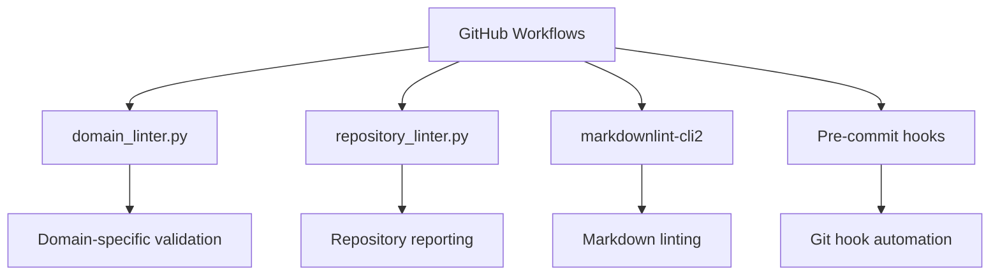

## 📋 Project Context

**Subproject:** `documents/` - MkDocs documentation website for Tournament Organizer  
**Current Focus:** Professional CI/CD infrastructure for markdown documentation  
**Priority:** Medium - Infrastructure optimization  
**Estimated Effort:** Large - Comprehensive analysis and refactoring  

## 🎯 Objective

Analyze and optimize the scripts folder structure to:

- Identify which scripts are essential for CI/CD workflows
- Replace custom scripts with professional industry-standard alternatives
- Streamline the infrastructure for MkDocs documentation website
- Eliminate redundant or outdated scripts
- Improve maintainability and reliability

## 📊 Current Scripts Inventory

### 🗂️ Root Level Scripts (`/scripts/`)

| Script | Purpose | CI/CD Usage | Replacement Candidate |
|--------|---------|-------------|----------------------|
| `docs-build.ps1` | Build MkDocs site | ❓ Used? | `uv run mkdocs build` |
| `docs-serve.ps1` | Serve docs locally | ❌ Dev only | `uv run mkdocs serve` |
| `setup.ps1` | Project initialization | ❓ Used? | `uv sync` |
| `validate-docs.ps1` | Doc validation | ❓ Used? | Professional linters |

### 🏢 Documents Scripts (`/documents/scripts/`)

| Category | Scripts | CI/CD Usage | Professional Alternative |
|----------|---------|-------------|-------------------------|
| **CLI Tools** | `cli/lint_cli.py` | ✅ Used | Keep - Custom domain logic |
| **Git Hooks** | `pre-commit-domain-lint.*` | ✅ Used | Pre-commit framework |
| **Domain Linting** | `domain_linter.py` | ✅ Critical | Keep - Core functionality |
| **Repository Analysis** | `repository_linter.py` | ✅ Used | Keep - Custom reporting |
| **MD Fixes** | `md_fixes/*.py` (12 files) | ❓ Used? | `markdownlint-cli2 --fix` |
| **Enterprise Tools** | `enterprise_fix_all.py` | ❓ Used? | Ruff + professional tools |
| **Validation** | `validation/*.py` | ❓ Used? | Professional alternatives |

## 🔍 Professional Tool Analysis

### ✅ Already Implemented Professional Tools

| Tool | Purpose | Status | Usage |
|------|---------|--------|-------|
| **Ruff** | Python linting/formatting | ✅ Configured | Replace custom Python scripts |
| **MyPy** | Type checking | ✅ Configured | Static analysis |
| **Bandit** | Security scanning | ✅ Configured | Security analysis |
| **Pytest** | Testing framework | ✅ Configured | Test automation |
| **Pre-commit** | Git hook framework | ✅ Configured | Replace custom git hooks |
| **markdownlint-cli2** | Markdown linting | ✅ Used in CI | Replace custom MD linters |
| **UV** | Dependency management | ✅ Used | Replace pip/setup scripts |

### 🎯 Replacement Opportunities

#### 1. **Markdown Processing**

- **Current:** 12 custom `fix_md*.py` scripts
- **Professional Alternative:** `markdownlint-cli2 --fix`
- **Benefits:** Industry standard, maintained, comprehensive

#### 2. **Git Hooks**

- **Current:** Custom `.ps1` and `.sh` scripts
- **Professional Alternative:** Pre-commit framework with hooks
- **Benefits:** Standardized, cross-platform, extensible

#### 3. **Documentation Building**

- **Current:** Custom PowerShell scripts
- **Professional Alternative:** Direct MkDocs commands or GitHub Actions
- **Benefits:** Simpler, no custom maintenance

#### 4. **Python Code Quality**

- **Current:** Custom enterprise scripts
- **Professional Alternative:** Ruff + MyPy + Bandit integration
- **Benefits:** Faster, more comprehensive, industry standard

## 🚀 Current CI/CD Workflow Analysis

### ✅ Essential for CI/CD

### ❓ Analysis Required

| Script Category | Current Usage | Professional Alternative |
|------------------|---------------|-------------------------|
| MD Fix Scripts | Unknown CI usage | `markdownlint-cli2 --fix` |
| PowerShell Utils | Local dev only? | Direct tool commands |
| Enterprise Scripts | Overlap with Ruff? | Professional tool stack |
| Validation Scripts | Redundant with linters? | Integrated validation |

## 🔧 Implementation Plan

### Phase 1: Audit & Analysis

- [ ] **Script Usage Analysis**
  - [ ] Analyze GitHub Actions workflows for script dependencies
  - [ ] Check pre-commit configuration for script usage
  - [ ] Review local development scripts necessity
  - [ ] Document current script call chains

- [ ] **Professional Tool Mapping**
  - [ ] Map each custom script to professional alternative
  - [ ] Identify functionality gaps requiring custom scripts
  - [ ] Assess performance and feature comparisons
  - [ ] Plan migration strategy for each component

### Phase 2: Professional Tool Integration

- [ ] **Markdown Processing Modernization**
  - [ ] Replace custom MD fix scripts with `markdownlint-cli2 --fix`
  - [ ] Configure markdownlint rules to match current behavior
  - [ ] Test automated fixing capabilities
  - [ ] Update CI/CD workflows to use professional tools

- [ ] **Git Hook Standardization**  
  - [ ] Migrate custom git hooks to pre-commit framework
  - [ ] Configure pre-commit with professional hooks
  - [ ] Test cross-platform compatibility
  - [ ] Remove custom hook scripts

- [ ] **Documentation Build Optimization**
  - [ ] Replace PowerShell scripts with direct MkDocs commands
  - [ ] Optimize GitHub Actions for documentation building
  - [ ] Implement containerized build process
  - [ ] Remove redundant build scripts

### Phase 3: Custom Script Consolidation

- [ ] **Core Functionality Preservation**
  - [ ] Keep domain_linter.py (core domain validation logic)
  - [ ] Keep repository_linter.py (custom reporting needs)
  - [ ] Keep cli/lint_cli.py (domain-specific CLI interface)
  - [ ] Refactor to integrate with professional tools

- [ ] **Script Removal & Cleanup**
  - [ ] Remove redundant MD fix scripts
  - [ ] Remove obsolete PowerShell utilities
  - [ ] Remove enterprise scripts overlapping with Ruff
  - [ ] Clean up unused validation scripts

### Phase 4: CI/CD Optimization

- [ ] **Workflow Modernization**
  - [ ] Update GitHub Actions to use professional tools directly
  - [ ] Optimize container builds with professional tool stack
  - [ ] Implement efficient caching strategies
  - [ ] Reduce workflow execution time

- [ ] **Quality Gate Integration**
  - [ ] Integrate professional tools in quality gates
  - [ ] Configure automated fixing workflows
  - [ ] Implement comprehensive reporting
  - [ ] Ensure zero-configuration development setup

## 📋 Success Criteria

### ✅ Infrastructure Modernization

- [ ] **Reduced Complexity:** 50%+ reduction in custom scripts
- [ ] **Professional Standards:** Industry-standard tools for all processes
- [ ] **Maintainability:** Minimal custom code requiring maintenance
- [ ] **Performance:** Faster CI/CD execution times

### ✅ Developer Experience

- [ ] **Zero Configuration:** New developers can contribute immediately
- [ ] **Cross-Platform:** Works on Windows, macOS, Linux
- [ ] **IDE Integration:** Professional tools integrate with editors
- [ ] **Documentation:** Clear usage documentation for all tools

### ✅ CI/CD Reliability

- [ ] **Stability:** Reduced custom script maintenance burden
- [ ] **Consistency:** Standardized tool behavior across environments
- [ ] **Extensibility:** Easy to add new quality checks
- [ ] **Monitoring:** Comprehensive quality reporting

## 🛠️ Technical Requirements

### MkDocs Documentation Website Focus

This analysis focuses specifically on supporting the **MkDocs documentation website** for Tournament Organizer:

- [ ] **Markdown Processing:** Professional markdown linting and fixing
- [ ] **Documentation Building:** Optimized MkDocs build process
- [ ] **Quality Assurance:** Comprehensive documentation quality checks
- [ ] **Content Validation:** Domain-specific content validation (keep custom)
- [ ] **Workflow Integration:** Seamless GitHub Actions integration

### Professional Tool Integration

- [ ] **Ruff Integration:** Replace custom Python linting scripts
- [ ] **markdownlint-cli2:** Replace custom markdown processing
- [ ] **Pre-commit Framework:** Replace custom git hooks
- [ ] **UV Ecosystem:** Leverage modern Python tooling
- [ ] **Container Optimization:** Professional containerized workflows

## 📚 Related Documentation

- [Professional Environment Report](../documents/PROFESSIONAL_ENVIRONMENT_REPORT.md) - Current professional tools
- [Containerized Development](../documents/compose.yml) - Container setup
- [Quality Control](../documents/quality_control.py) - Professional automation
- [Pre-commit Configuration](../documents/.pre-commit-config.yaml) - Git hooks
- [GitHub Workflows](../.github/workflows/) - CI/CD configuration

## 🔗 Dependencies

### Must Complete Before

- [ ] Professional development environment (✅ Complete)
- [ ] Container infrastructure (✅ Complete)
- [ ] Quality control automation (✅ Complete)

### Enables After Completion

- [ ] Faster CI/CD pipelines
- [ ] Reduced maintenance burden  
- [ ] Enhanced developer experience
- [ ] Industry-standard infrastructure

## 📊 Expected Outcomes

### Quantifiable Improvements

- **Script Count:** Reduce from 30+ scripts to 10-15 essential scripts
- **CI/CD Time:** 20-30% faster workflow execution
- **Maintenance:** 70% reduction in custom script maintenance
- **Developer Setup:** From 15 minutes to 2 minutes for new contributors

### Qualitative Benefits

- **Industry Standards:** Professional tool ecosystem
- **Reliability:** Reduced custom code failure points
- **Extensibility:** Easy to add new capabilities
- **Knowledge:** Team knowledge of industry-standard tools

---

**Analysis Focus:** MkDocs documentation website infrastructure  
**Modernization Goal:** Professional CI/CD with minimal custom scripts  
**Success Metric:** Industry-standard toolchain with optimized performance
