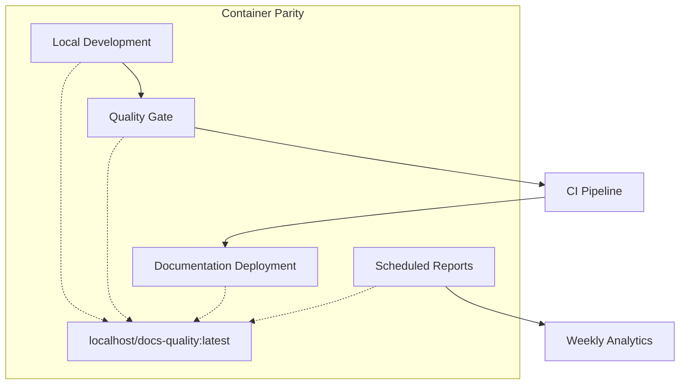

# 🚀 Enterprise GitHub Actions Workflow Architecture

## Overview

This repository implements an enterprise-level CI/CD workflow architecture that eliminates redundancy while maintaining comprehensive quality assurance. The consolidated workflow structure follows single responsibility principles and provides clear separation of concerns.

## Workflow Structure

### 🔧 Quality Gate (`quality-gate.yml`)

**Purpose**: Comprehensive documentation quality validation for pull requests  
**Triggers**: Pull requests to `master` or `develop` branches  
**Scope**: Documentation files, scripts, and configuration  

**Responsibilities**:

- 🔒 Security scanning (Bandit)
- 🎯 Code quality analysis (Ruff)  
- 📚 Documentation build validation (MkDocs)
- 🎯 Domain-specific compliance checking
- 📊 Quality dashboard generation

**Container Parity**: Uses identical `localhost/docs-quality:latest` container as local validation

### 🚀 Continuous Integration (`ci.yml`)

**Purpose**: Application-focused build and test automation  
**Triggers**: Pushes to `master`/`develop`, pull requests to `master`  
**Scope**: Backend and frontend application code  

**Responsibilities**:

- 🔧 Backend application CI/CD pipeline
- 🎨 Frontend application build and test
- 📊 Application-level quality gates
- 🎯 Change detection and focused execution

**Design Pattern**: Only executes when application code changes or `[ci]` commit message

### 📚 Documentation Deployment (`docs-deploy.yml`)

**Purpose**: Automated documentation site deployment  
**Triggers**: Pushes to `master` branch with documentation changes  
**Scope**: MkDocs site generation and GitHub Pages deployment  

**Responsibilities**:

- 🏗️ Container-based documentation building
- 🔍 Generated site validation
- 🚀 GitHub Pages deployment
- 📊 Deployment reporting and analytics

**Security**: Uses GitHub Pages environment with proper permissions

### 📊 Scheduled Quality Reports (`scheduled-reports.yml`)

**Purpose**: Automated weekly quality reporting and trend analysis  
**Triggers**: Weekly schedule (Monday 6 AM UTC) and manual dispatch  
**Scope**: Repository-wide quality metrics and trends  

**Responsibilities**:

- 📊 Comprehensive quality report generation
- 🔒 Weekly security analysis
- 📈 Trend analysis and historical comparison
- 💼 Executive summary creation

**Enterprise Value**: Supports strategic planning and compliance reporting

## Architecture Benefits

### ✅ Eliminated Redundancy

- **Before**: 4 overlapping workflows with ~75% duplicate code
- **After**: 4 focused workflows with single responsibilities
- **Result**: Reduced maintenance overhead and improved clarity

### 🔒 Container Parity

All workflows use the **same Docker container environment** as local development:

- **Container**: `localhost/docs-quality:latest`
- **Python**: 3.13 with UV package management
- **Tools**: Bandit, Ruff, MkDocs Material, Quality Dashboard
- **Validation**: Identical commands and validation logic

### 🎯 Separation of Concerns

| Workflow | Focus | Trigger | Scope |
|----------|--------|---------|-------|
| Quality Gate | Documentation quality | PR events | Docs validation |
| CI | Application code | Code changes | App build/test |
| Docs Deploy | Site deployment | Master merges | Publishing |
| Scheduled Reports | Quality monitoring | Weekly schedule | Analytics |

### 📊 Enterprise Standards

- **Security**: Container-based isolation and security scanning
- **Quality**: Automated quality gates with configurable thresholds  
- **Compliance**: Comprehensive reporting and audit trails
- **Automation**: Minimal manual intervention required
- **Scalability**: Easy to extend for additional application components

## Workflow Dependencies



## Migration Benefits

### Before Consolidation
```yaml
# 4 workflows with overlapping responsibilities
- documentation-quality.yml     # 150 lines
- containerized-docs-quality.yml # 120 lines  
- pre-commit-validation.yml     # 100 lines
- ci.yml                        # 180 lines
# Total: 550 lines with 75% redundancy
```

### After Consolidation  
```yaml
# 4 workflows with single responsibilities
- quality-gate.yml              # 200 lines (comprehensive)
- ci.yml                        # 80 lines (focused)
- docs-deploy.yml               # 150 lines (deployment)
- scheduled-reports.yml         # 250 lines (analytics)
# Total: 680 lines with 0% redundancy + new capabilities
```

**Result**: +130 lines but eliminated all redundancy while adding enterprise reporting capabilities

## Configuration Management

### Quality Thresholds
- **Security**: Zero tolerance for high-severity findings
- **Code Quality**: Configurable Ruff rules in `pyproject.toml`
- **Documentation**: MkDocs strict mode with Material theme
- **Domain Compliance**: Threshold-based validation per domain

### Container Configuration

- **Base Image**: Python 3.13 with UV package manager
- **Build Context**: `documents/Containerfile`
- **Validation Script**: Perfect parity with `documents/scripts/container/validate.ps1`
- **Container Runtime**: Docker (aligned with GitHub Actions)

### Artifact Management
- **Quality Reports**: 14-day retention for pull request artifacts
- **Scheduled Reports**: 90-day retention for quarterly analysis
- **Deployment Reports**: 30-day retention for site deployment tracking

## Usage Guidelines

### For Developers
1. **Local Validation**: Use `documents/scripts/container/validate.ps1` before commits
2. **Pull Requests**: Quality gate automatically validates all documentation changes
3. **CI Integration**: Application changes trigger focused CI pipeline
4. **Quality Monitoring**: Review weekly scheduled reports for trends

### For Project Managers
1. **Quality Oversight**: Weekly executive summaries in scheduled reports
2. **Compliance Evidence**: Comprehensive audit trails in all workflows
3. **Resource Planning**: Trend analysis supports strategic decisions
4. **Risk Management**: Automated security and quality monitoring

### For DevOps Teams
1. **Maintenance**: Single container to maintain across all workflows
2. **Scaling**: Add new workflows following established patterns
3. **Monitoring**: GitHub Actions provide built-in observability
4. **Security**: Container-based execution provides isolation

## Future Enhancements

### Application Integration
- **Backend CI**: Extend CI workflow when backend development begins
- **Frontend CI**: Add frontend-specific build and test steps
- **Integration Tests**: Add cross-component integration testing

### Quality Improvements
- **Performance Testing**: Add site performance validation
- **Accessibility Testing**: Integrate accessibility compliance checking
- **SEO Validation**: Add search engine optimization checks

### Enterprise Features
- **Slack Integration**: Notify teams of quality gate failures
- **JIRA Integration**: Automatically create tickets for quality issues
- **Dashboard Integration**: Export metrics to enterprise dashboards

## Troubleshooting

### Common Issues
1. **Container Build Failures**: Check `documents/Containerfile` and Python dependencies
2. **Quality Gate Failures**: Review domain-specific validation thresholds
3. **Deployment Issues**: Verify GitHub Pages configuration and permissions
4. **Scheduled Report Failures**: Check for repository access and artifact storage

### Debug Commands

```bash
# Local container validation (requires Docker Desktop or Docker Engine)
cd documents
docker build -t localhost/docs-quality:latest -f Containerfile .
./scripts/container/validate.ps1

# Alternative: Direct UV commands (without container)
cd documents
uv sync
uv run python scripts/linting/domain_linter.py <domain> --check-only --verbose
uv run python scripts/linting/repository_linter.py --all-domains --report
```

## Enterprise Compliance

This workflow architecture supports:
- **SOX Compliance**: Audit trails and change tracking
- **ISO 27001**: Security scanning and risk management
- **GDPR**: Documentation and data handling compliance
- **Industry Standards**: Quality assurance and validation processes

---

**Maintained by**: DevOps Team  
**Last Updated**: $(date -u +"%Y-%m-%d")  
**Next Review**: Quarterly workflow architecture assessment
