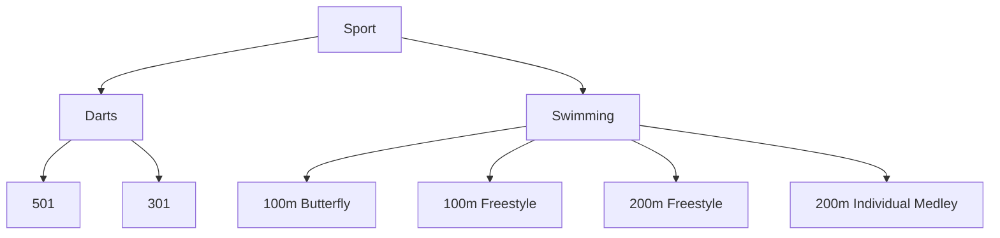
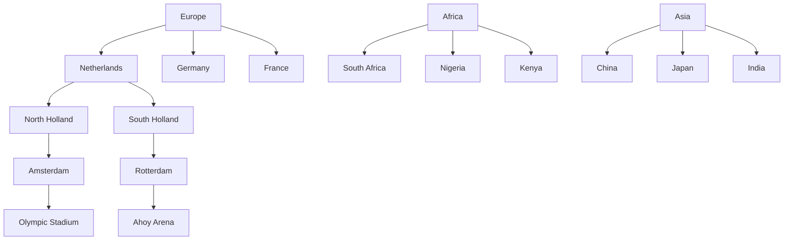

# Category (Template Entity)

tag: category, classification, template, hierarchy, criterium

## Overview

A Category is a template entity that organizes and structures business objects within the tournament system. Categories provide a hierarchical way to group and classify elements, supporting logical organization, flexible classification, and consistent data management.

## Purpose

- Enable standardized grouping and classification of entities (e.g., teams, venues, equipment).
- Support hierarchical structures for nested categories and subcategories.
- Facilitate rule-based organization and eligibility through links to criteria and types.

## Structure

This template entity includes standard attributes from the [Base Entity](../foundation/base_entity.md).

### Attributes

| Attribute         | Description                                            | Type                          | Required | Example                                                        |
| ----------------- | ------------------------------------------------------ | ----------------------------- | -------- | -------------------------------------------------------------- |
| Name              | Name for the category                                  | String                        | Yes      | Swimming Pools, Professional Teams, Electronic Equipment       |
| Description       | Explanation of what this category represents           | Text                          | Yes      | All swimming facilities used for competitions                  |
| Type              | Embedded [Type](../classification/type.md)             | Optional[Type]                | No       | User Role, Competition                                         |
| Subcategories     | List of embedded [Category](category.md) documents     | Optional[List[Category]]      | No       | For leaf categories                                            |
| Criteria          | List of embedded [Criterium](../classification/criterium.md) | Optional[List[Criterium]] | No       | Eligibility rules for this category                            |

## Example

### Example: Sports Category Hierarchy

This diagram illustrates how sports and their specific variants are organized using categories. For instance, "Darts" is a category with subcategories for game types like "501" and "301." "Swimming" is another category, with subcategories for event types such as "100m Butterfly" and "200m Individual Medley." This hierarchical structure helps tournament organizers group, classify, and manage sports and their variants for scheduling, reporting, and eligibility.

### Example: Geographical Category Hierarchy

This diagram provides a concrete example of how geographical categories can be structured. The top-level categories are continents (Europe, Africa, Asia), each containing countries, which are further divided into regions or states, then cities, and finally venues. For example, "Europe" contains "Netherlands," which contains "North Holland" and "South Holland," which in turn contain cities like "Amsterdam" and "Rotterdam." Cities contain venues such as "Olympic Stadium" and "Ahoy Arena." This hierarchy enables organizers to filter, select, and manage tournaments, teams, or participants by location, making event planning and reporting more efficient.

## See Also

- [Criterium](criterium.md)
- [Type](type.md)
- [Dimension](dimension.md)
- [Classification Domain README](README.md)
- [Area](../venue/area.md)
- [Zone](../venue/zone.md)
- [Interest](../identity/attributes/interest.md)
