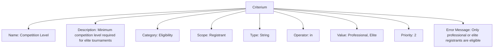
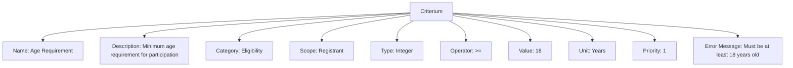

# Criterium (Template Entity)

tag: criterium, classification, template, rule, eligibility

## Overview

A Criterium is a template entity that defines a specific requirement, condition, or standard used to evaluate eligibility, classification, or qualification for tournaments, events, teams, or registrants. Criterium templates provide a flexible way to define and validate rules for participation and classification.

## Purpose

- Enable standardized definition of rules and requirements for tournament participation and classification.
- Support flexible, reusable criteria for different contexts (e.g., age, skill level, membership).
- Facilitate rule-based validation and eligibility checking.

## Structure

This template entity includes standard attributes from the [Base Entity](../foundation/base_entity.md).

### Attributes

| Attribute         | Description                                     | Type    | Required | Notes / Example                              |
| ----------------- | ----------------------------------------------- | ------- | -------- | -------------------------------------------- |
| **Name**          | Unique identifier for the criterium.            | String  | Yes      | `Age Requirement`, `Skill Level`             |
| **Description**   | Detailed explanation of the criterium.          | Text    | Yes      | `Minimum age requirement for participation.` |
| **Category**      | Embedded [Category](../classification/category.md) classification of the criterium. | Category | No       | `Eligibility`    |
| **Scope**         | What the criterium applies to.                  | String  | Yes      | `Registrant`, `Team`, `Tournament`          |
| **Type**          | Embedded [Type](../classification/type.md) of value being evaluated. | Type | Yes      | `String`, `Integer`    |
| **Operator**      | The comparison operator to use.                 | String  | Yes      | `>=`, `<=`, `==`, `in`, `between`            |
| **Value**         | The value to compare against.                   | Mixed   | Yes      | `18`, `true`, `["Beginner", "Intermediate"]` |
| **Unit**          | Embedded [Unit](../classification/measurement/unit.md) of measurement (if applicable). | Unit    | No       | `Years`, `Meters`    |
| **Priority**      | Order of evaluation relative to other criteria. | Integer | No       | `1` (highest) to `10` (lowest)               |
| **Error Message** | Custom message shown when criterium is not met. | String  | No       | `"Must be at least 18 years old"`            |

## Example

### Example: Competition Level Criterium

This diagram shows a criterium template for competition level. The criterium ensures that only registrants with a competition level of "Professional" or "Elite" are eligible for certain tournaments. The operator "in" checks if the registrant's competition level matches one of the allowed values. The category "Eligibility" links this criterium to the broader context of tournament participation rules. Priority and error message attributes help organizers manage rule evaluation and provide clear feedback. This template can be used to restrict entry to top-tier competitions, ensuring fair play and appropriate skill matching. Adjusting the value or operator allows organizers to tailor eligibility for different event types or divisions.

### Example: Age Requirement Criterium

This example demonstrates how a criterium template can be used to enforce eligibility rules in a tournament system. The Age Requirement criterium is designed to ensure that only registrants who meet a minimum age threshold are allowed to register or compete. By specifying the scope as "Registrant," the rule targets individual registrants. The operator (>=) and value (18) define the logic for validation, while the unit (Years) clarifies the measurement context. Priority allows organizers to control the order in which multiple criteria are evaluated, and the error message provides clear feedback to users who do not meet the requirement. This approach supports automated, transparent, and consistent enforcement of tournament rules, reducing manual checks and improving fairness across events. The template can be adapted for other eligibility criteria, such as skill level or membership status, by adjusting the relevant attributes.

## See Also

- [Type](../classification/type.md)
- [Category](../classification/category.md)
- [Dimension](../classification/dimension.md)
- [Date Of Birth](../identity/attributes/date_of_birth.md)
- [Physical](../identity/attributes/physical.md)
- [Rule](../tournament/rule.md)
- [Registrant](../registration/registrant.md)
