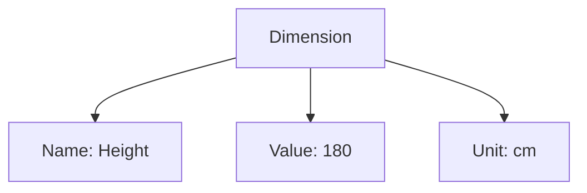
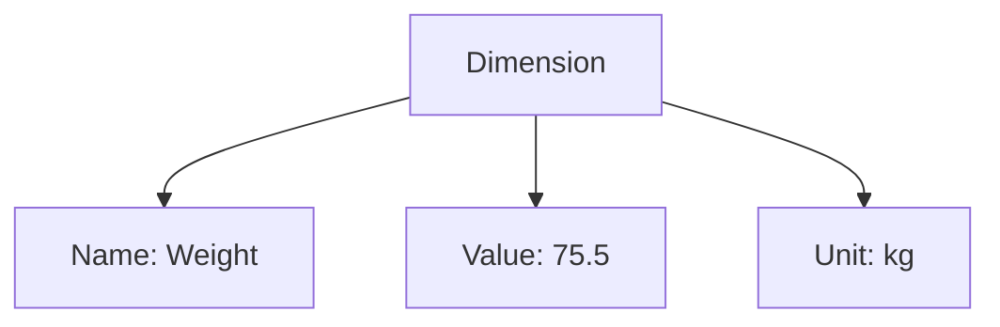

---
tags:

  - classification
  - value-object
  - measurement
  - dimension

---

# Dimension (value object)

## Overview

A Dimension is a value object representing a measurable property or characteristic, such as length, width, height, or weight. Dimensions describe physical attributes of entities (e.g., teams’ equipment, venues) and support classification, validation, and comparison operations.

## Example

### Height dimension for a registrant

This diagram illustrates a Dimension value object for a registrant's height. The dimension is named "Height," with a value of 180 and the unit "cm." This structure can be embedded within a Registrant entity when needed for eligibility checks (such as minimum or maximum height requirements), classification (like grouping by weight classes), and consistent measurement standards.

### Equipment weight dimension

This example demonstrates a Dimension value object for equipment weight. The dimension is named "Weight," has a value of 75.5, and uses the unit "kg." This structure supports validation (e.g., equipment weight limits), classification (e.g., equipment categories), and ensures consistent measurement standards. The template can be adapted for other measurements, such as length or capacity, by changing the relevant attributes.

## See also

- [Measurement](measurement/measurement.md)
- [Unit](measurement/unit.md)
- [Physical](../identity/attributes/physical.md)
- [Category](category.md)
