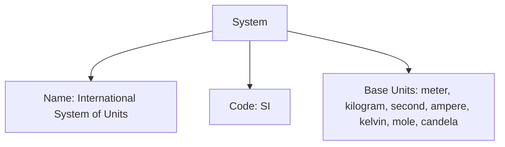

---
tags:
  - system
  - entity
  - measurement
  - classification
---

# System (Entity)

## Overview

A System represents a complete system of measurement (such as SI, Imperial, or Custom). It serves as a container for related units and defines the rules and conventions for measurements within that system. Systems have a unique identity and lifecycle, managed according to the [Base Entity](../../foundation/base_entity.md).

## Purpose

To provide a standardized framework for organizing units, supporting measurement consistency, and enabling reliable conversions and validation across the tournament system.

## Structure

| Attribute    | Type       | Required | Description                                                                 | Example(s)                                 |
|--------------|------------|----------|-----------------------------------------------------------------------------|--------------------------------------------|
| Name         | String     | Yes      | The name of the measurement system.                                         | "International System of Units"           |
| Description  | String     | No       | A detailed description of the system and its usage.                         | "The modern form of the metric system"    |
| Code         | String     | Yes      | A short code identifier for the system.                                     | "SI"                                      |
| Base Units   | List[Unit] | Yes      | List of embedded [Unit](../../classification/measurement/unit.md) records that are base units. | [Second, Meter]           |

## Example

### Example: International System of Units (SI)

This example illustrates a System entity for the International System of Units (SI). The system is named "International System of Units," uses the code "SI," and lists its base units (meter, kilogram, second, ampere, kelvin, mole, candela). This structure enables organizers to manage measurement standards, maintain consistency, and support unit conversions throughout the tournament system. By referencing a system like SI, all measurements and units can be validated and compared reliably.

## See Also

- [Unit](../../classification/measurement/unit.md): Defines measurement units and scales.
- [Measurement](../../classification/measurement/measurement.md): Value object for quantitative values.
- [Dimension](../../classification/dimension.md): Describes measurable properties.
- [Type](../../classification/type.md): Classification and categorization.
