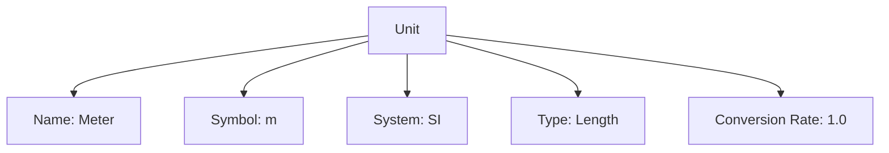

---
tags:
  - unit
  - entity
  - measurement
  - classification
---

# Unit (Entity)

## Overview

A Unit represents a standardized unit of measurement (such as meter, kilogram, or second). Units are fundamental building blocks for measurement systems, providing consistent ways to quantify physical properties. Each unit has a unique identity and lifecycle, managed according to the [Base Entity](../../foundation/base_entity.md).

## Purpose

To enable standardized, precise, and consistent measurement of physical properties across the tournament system, supporting validation, conversion, and interoperability.

## Structure

| Attribute        | Type    | Required | Description                                                                 | Example(s)                                 |
|------------------|---------|----------|-----------------------------------------------------------------------------|--------------------------------------------|
| Name             | String  | Yes      | The name of the unit.                                                       | "meter"                                   |
| Description      | String  | No       | A detailed description of the unit and its usage.                           | "The meter is the base unit of length in the SI system" |
| Symbol           | String  | Yes      | The standard symbol for the unit.                                           | "m"                                       |
| Type             | Type    | Yes      | Embedded [Type](../../classification/type.md) of measurement this unit represents. | `Time`, `Length`    |
| System           | System  | Yes      | Embedded [System](../../classification/measurement/system.md) this unit belongs to. | `SI`, `Imperial`    |
| Conversion Rate  | Decimal | Yes      | The conversion rate to the base unit in its system.                         | 1.0 (for base units), 0.001 (for derived units) |

## Example

### Example: Meter Unit in SI System

This diagram shows a Unit entity for the "meter" in the SI system. The unit is named "Meter," uses the symbol "m," belongs to the SI system, and represents the type "Length." The conversion rate is 1.0, indicating it is the base unit for length in SI. This structure allows organizers to standardize measurements, ensure consistency, and support conversions between units in the same system.

## See Also

- [System](../../classification/measurement/system.md): Defines measurement systems and conventions.
- [Measurement](../../classification/measurement/measurement.md): Value object for quantitative values.
- [Dimension](../../classification/dimension.md): Describes measurable properties.
- [Type](../../classification/type.md): Classification and categorization.
