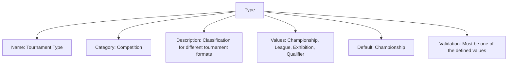
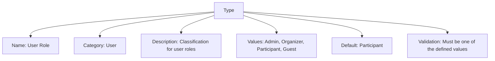

---
tags:

  - type
  - classification
  - template
  - categorization

---

# Type (Template Entity)

## Overview

A Type is a template entity representing a classification or categorization within the tournament system. Types provide a consistent way to manage type information for classification, organization, and validation across tournaments, teams, users, and other entities.

## Purpose

- Enable standardized categorization and classification for entities in the tournament system.
- Support flexible, reusable type definitions for different contexts (e.g., tournament format, team type, user role).
- Facilitate validation and organization by defining allowed values and defaults.

## Structure

This template entity includes standard attributes from the [Base Entity](../foundation/base_entity.md).

### Attributes

| Attribute       | Description                                      | Type     | Required | Notes / Example                                           |
| --------------- | ------------------------------------------------ | -------- | -------- | --------------------------------------------------------- |
| **Name**        | The name of the type.                            | String   | Yes      | `Tournament Type`, `Team Type`, `User Type`               |
| **Category**    | The category of the type.                        | String   | No       | `Competition`, `Organization`, `User`, `System`           |
| **Description** | Description of the type.                         | String   | No       | `Classification for different tournament formats`          |
| **Values**      | List of possible values for this type.           | List     | Yes      | `[Championship, League, Exhibition, Qualifier]`           |
| **Default**     | The default value for this type.                 | String   | No       | `Championship`, `Standard`, `Regular`                     |
| **Validation**  | Validation rules for this type.                  | String   | No       | `Must be one of the defined values`, `Required field`     |

## Example

### Example: Tournament Type

This example shows a Type template for "Tournament Type." The type is used to classify tournaments by format, such as "Championship," "League," "Exhibition," or "Qualifier." The default value is "Championship," and the validation rule ensures only allowed values are used. This structure helps organizers consistently categorize tournaments, enforce rules, and streamline scheduling and reporting.
This example shows a Type template entity for tournament formats. The type is named "Tournament Type," categorized under "Competition," and describes different tournament formats. Allowed values include "Championship," "League," "Exhibition," and "Qualifier," with "Championship" as the default. The validation rule ensures only defined values are accepted. This template supports consistent classification and validation of tournament formats across the system.

### Example: User Role Type

This example demonstrates a Type template entity for user roles. The type is named "User Role," categorized under "User," and describes different roles users can have in the system. Allowed values are "Admin," "Organizer," "Participant," and "Guest," with "Participant" as the default. Here, "Participant" is a user role label, not a synonym for teams competing in stages. The validation rule enforces selection from the defined values. This template supports role-based access and organization throughout the tournament platform.

---

<!-- References intentionally omitted as per documentation standards. -->

## See Also

- [Category](../classification/category.md)
- [Criterium](../classification/criterium.md)
- [Dimension](../classification/dimension.md)
- [Measurement](../classification/measurement/measurement.md)
- [Registrant](../registration/registrant.md)
- [Classification README](../classification/README.md)
- [Tournament](../tournament/tournament.md)
- [Team](../team/team.md)
- [Account](../identity/account/account.md)
