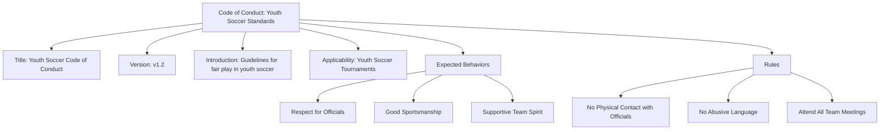
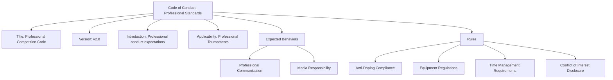

---
tags:

  - code-of-conduct
  - behavior
  - template
  - rule
  - conduct

---

# Code of Conduct (Template Entity)

## Overview

A Code of Conduct is a template entity that defines comprehensive behavioral frameworks for tournament environments. It combines mandatory rules and positive expected behaviors to create complete conduct standards that can be instantiated and customized for specific contexts while maintaining core behavioral principles.

## Purpose

- Enable standardized behavioral frameworks across different tournament contexts and organizations.
- Support template-based conduct management that balances consistency with customization needs.
- Facilitate comprehensive conduct standards through integrated rules and expected behaviors.

## Structure

This template entity includes standard attributes from the [Base Entity](../foundation/base_entity.md).

### Attributes

| Attribute | Description | Type | Required | Example |
|-----------|-------------|------|----------|---------|
| Title | Official name for the code of conduct template | String | Yes | Fair Play and Respect Policy, Standard Tournament Code of Conduct |
| Version | Version identifier for template tracking | String | Optional | v2.1, 2024-07-28 |
| Introduction | Introductory text explaining purpose and context | Text | Optional | This document outlines the behavior expected of all participants... |
| Applicability | Intended scope or context for the template | String | Optional | Tournament - General, Youth Events, Professional Competition |
| Expected Behaviors | List of positive behavioral standards | List[[Expected Behavior](expected_behavior.md)] | Optional | Embedded expected behavior entities |
| Rules | List of mandatory requirements with consequences | List[[Rule](rule.md)] | Optional | Embedded rule entities |

## Example

### Example 1: Youth Tournament Code of Conduct

This example illustrates a complete youth soccer code of conduct template showing all attributes. The Title identifies the specific context (Youth Soccer), Version tracks template evolution (v1.2), Introduction provides context for the document's purpose, and Applicability clearly defines the scope (Youth Soccer Tournaments). The template includes three Expected Behaviors that promote positive conduct (respect, sportsmanship, team spirit) and three Rules with enforceable requirements (no physical contact, no abuse, attendance). This comprehensive approach ensures youth tournaments have both aspirational standards and clear boundaries, helping organizers maintain safe, positive environments while teaching good conduct principles.

### Example 2: Professional Competition Code of Conduct

This example demonstrates a professional-level code of conduct template with more complex requirements. The Title reflects the professional context, Version indicates a major update (v2.0), Introduction sets professional expectations, and Applicability targets professional competition settings. The Expected Behaviors focus on professional communication and media responsibilities appropriate for high-level competition, while Rules address critical professional requirements including anti-doping compliance, equipment standards, time management, and conflict disclosure. This template enables tournament organizers to maintain professional standards while providing clear frameworks for enforcement and education.

## See Also

- [Code of Conduct Domain](README.md)
- [Expected Behavior](expected_behavior.md)
- [Organization Domain](../organization/README.md)
- [Rule](rule.md)
- [Safety Domain](../safety/README.md)
- [Tournament Domain](../tournament/README.md)
