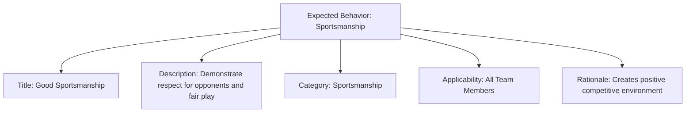
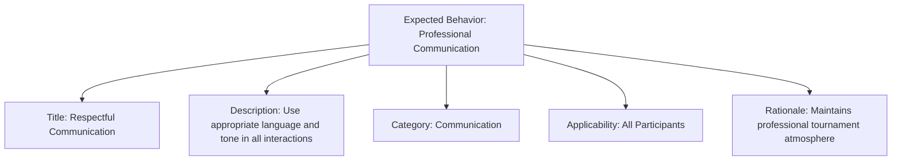

---
tags:
  - expected-behavior
  - conduct
  - template
  - positive
  - behavior
---

# Expected Behavior (Template Entity)

## Overview

An Expected Behavior is a template entity that defines positive, aspirational conduct standards for tournament participants. It focuses on encouraging good behavior and creating positive environments rather than prohibiting actions, providing clear examples and rationale for why specific behaviors are valued.

## Purpose

- Enable standardized positive behavioral expectations across tournament environments.
- Support template-based behavior management that promotes good conduct through clear examples.
- Facilitate aspirational standards that complement mandatory rules with positive guidance.

## Structure

This template entity includes standard attributes from the [Base Entity](../foundation/base_entity.md).

### Attributes

| Attribute | Description | Type | Required | Example |
|-----------|-------------|------|----------|---------|
| Title | Short, descriptive name for the expected behavior | String | Yes | Sportsmanship, Respect for Officials, Team Support |
| Description | Detailed explanation of the expected behavior | Text | Yes | Treat all participants with respect and dignity... |
| Category | Classification of the behavior type | String | No | Respect, Sportsmanship, Professionalism, Communication |
| Applicability | Context where the behavior applies | String | No | All Participants, Officials, Spectators, Team Members |
| Rationale | Explanation of why this behavior is important | Text | No | Promotes fair play and positive tournament environment |

## Example

### Example 1: Sportsmanship Behavior Template

This example shows a complete sportsmanship expected behavior template covering all attributes. The Title provides a clear, recognizable name (Good Sportsmanship), while the Description gives specific guidance about respecting opponents and maintaining fair play standards. The Category classification (Sportsmanship) helps organizers group related behaviors, and Applicability clearly defines who should follow this standard (All Team Members). The Rationale explains why this behavior matters - creating positive competitive environments that enhance the tournament experience for everyone involved and promote the values of fair competition.

### Example 2: Communication Behavior Template

This example demonstrates a communication-focused expected behavior template with all required attributes. The Title identifies the specific behavior area (Respectful Communication), and the Description provides actionable guidance about language and tone expectations. The Category (Communication) enables organizers to group communication-related behaviors together for training and enforcement purposes. Applicability extends to All Participants, ensuring comprehensive coverage, while the Rationale explains the importance of maintaining professional tournament atmospheres that respect all participants and create inclusive environments conducive to fair competition.

## See Also

- [Code of Conduct](code_of_conduct.md)
- [Rule](rule.md)
- [Code of Conduct Domain](README.md)
- [Identity Domain](../identity/README.md)
- [Safety Domain](../safety/README.md)
