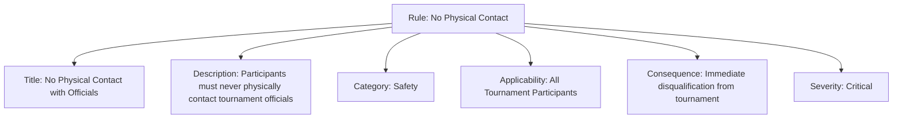
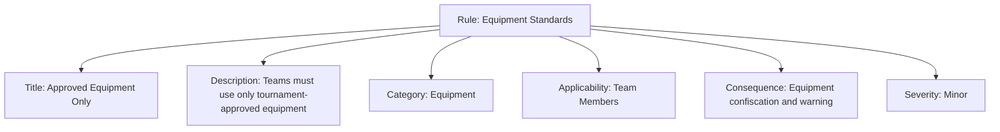

---
tags:
  - rule
  - conduct
  - template
  - enforcement
  - mandatory
---

# Rule (Template Entity)

## Overview

A Rule is a template entity that defines mandatory, enforceable requirements for tournament participants. It specifies clear prohibitions or obligations with defined consequences for non-compliance, providing the enforcement backbone for codes of conduct and ensuring consistent behavioral standards across tournament environments.

## Purpose

- Enable standardized mandatory requirements with clear enforcement mechanisms.
- Support template-based rule management that ensures consistent consequences and applicability.
- Facilitate enforceable standards that complement positive expected behaviors with clear boundaries.

## Structure

This template entity includes standard attributes from the [Base Entity](../foundation/base_entity.md).

### Attributes

| Attribute | Description | Type | Required | Example |
|-----------|-------------|------|----------|---------|
| Title | Short, descriptive name for the rule | String | Yes | No Physical Contact with Officials, Equipment Regulations |
| Description | Detailed explanation of the rule requirement | Text | Yes | Participants must not physically contact tournament officials... |
| Category | Classification of the rule type | String | No | Safety, Fair Play, Anti-Discrimination, Equipment |
| Applicability | Context where the rule applies | String | No | Tournament, Match, All Participants, Team Members |
| Consequence | Action taken if the rule is violated | Text | Yes | Immediate disqualification, Warning, Point penalty |
| Severity | Severity level of rule violations | String | No | Minor, Major, Critical, Automatic Disqualification |

## Example

### Example 1: Safety Rule Template

This example illustrates a critical safety rule template with all attributes clearly defined. The Title provides immediate recognition of the rule's focus (No Physical Contact with Officials), while the Description gives unambiguous guidance about the prohibited behavior. The Category classification (Safety) helps organizers group safety-related rules for training and enforcement protocols. Applicability ensures comprehensive coverage (All Tournament Participants), and the Consequence specifies immediate and severe action (disqualification) that matches the Critical severity level. This comprehensive approach enables tournament organizers to maintain safe environments with clear, enforceable boundaries that protect officials and maintain order.

### Example 2: Equipment Rule Template

This example demonstrates an equipment-focused rule template covering all required attributes. The Title clearly identifies the equipment requirement (Approved Equipment Only), and the Description provides specific guidance about tournament-approved equipment usage. The Category (Equipment) enables organizers to group equipment-related rules for consistent enforcement and equipment management protocols. Applicability targets Team Members specifically, while the Consequence outlines proportionate action (confiscation and warning) that aligns with the Minor severity classification. This balanced approach helps organizers maintain equipment standards while providing educational opportunities for teams to understand and comply with equipment requirements.

## See Also

- [Code of Conduct](code_of_conduct.md)
- [Expected Behavior](expected_behavior.md)
- [Code of Conduct Domain](README.md)
- [Safety Domain](../safety/README.md)
- [Discipline Domain](../discipline/README.md)
