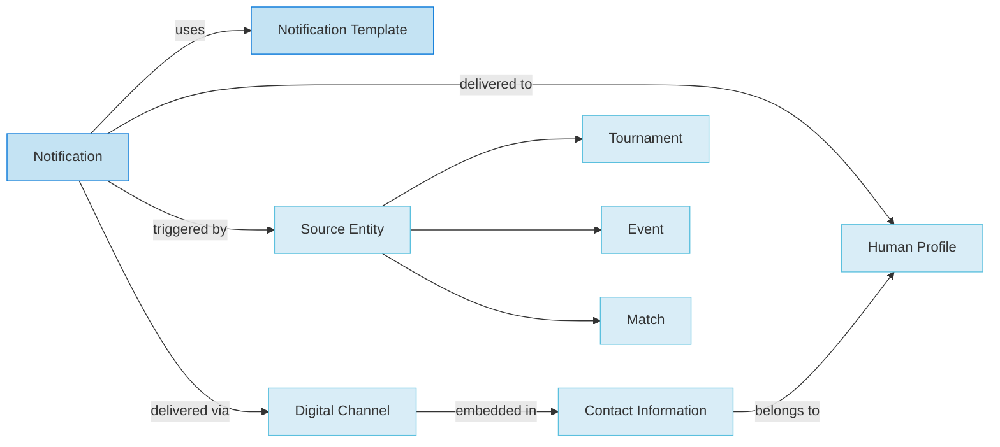

# **Communication Domain**

## **Overview**

The Communication domain manages all notification and messaging aspects of the Tournament Organizer system. It provides
comprehensive frameworks for creating, managing, and delivering notifications to users and systems, supporting both
direct notifications and template-based communication.

This domain focuses on data structures and models for storing communication-related information, while actual delivery
processes are managed in the Process domain. It uses a template-based approach for standardized notification formats and
supports multiple communication channels.



## **Domain Structure**

### **Core Models**

- **[Notification](notification.md)**: Entity template for messages and alerts with template-based functionality
- **[Digital Channel](../media/digital_channel.md)**: Value object for digital communication channels (embedded in Contact Information)

### **Related Models**

- **[Notification Template](notification.md)**: Template for reusable notification formats
- **[Human Profile](../identity/profile/human.md)**: Recipients of notifications
- **[Contact Information](../identity/contact_information.md)**: Contact details and digital channels

## **Template Entity Analysis**

### **Current Template Entities**

- **Notification**: Used as a template for standard notification formats, supports template variables
- **Notification Template**: Referenced by notifications for reusable formats
- **Digital Channel**: Value object template for digital communication channels

### **Potential Template Entities**

- **Notification Type Templates**: Standard notification categories and their attributes
- **Communication Channel Templates**: Standard channel configurations and settings
- **Message Format Templates**: Standard message formatting and styling
- **Delivery Preference Templates**: Standard delivery preferences and schedules

## **Status Lifecycle**

### **Notification Statuses**

- **Active**: Notification is created and ready for delivery
- **Read**: Notification has been read by the recipient
- **Archived**: Notification has been archived and is no longer active

### **Notification Template Statuses**

- **Active**: Template is available for use in notifications
- **Inactive**: Template is deprecated or no longer recommended

### **Lifecycle Transitions**

- Notification: Active → Read → Archived
- Notification Template: Active → Inactive

## **Relationships & Cross-References**

- **Notification ↔ Human Profile**: Recipients of notifications
- **Notification ↔ Source Entity**: Entity that triggered the notification (Tournament, Match, etc.)
- **Notification ↔ Notification Template**: Template-based notification creation
- **Digital Channel ↔ Contact Information**: Embedded digital presence information
- **Notification ↔ Variables**: Template variable substitution for personalized content
- **Notification ↔ Priority**: Priority-based delivery and processing

## **Template-Based Communication**

### **Notification Templates**

- Provide standardized notification formats
- Support variable substitution for personalization
- Enable consistent messaging across the system
- Reduce duplication and ensure quality

#### Example Notification Template

```json
{
  "template_id": "match_result",
  "type": "Email",
  "title": "Match Results: {{team1_name}} vs {{team2_name}}",
  "subject_line": "Match Results for {{tournament_name}}",
  "message_body": "Hello {{recipient_name}},\n\nThe results for the match between {{team1_name}} and {{team2_name}} are as follows:\n\nFinal Score: {{team1_name}} {{team1_score}} - {{team2_score}} {{team2_name}}\n\n{{#if next_match}}Your next match is scheduled for {{next_match.date}} at {{next_match.time}}.\n\nOpponent: {{next_match.opponent}}{{/if}}{{#unless next_match}}This concludes your participation in this stage of the tournament.{{/unless}}\n\nBest regards,\nTournament Organizer",
  "priority": "Normal",
  "version": "1.2",
  "created_at": "2025-05-10T14:30:00Z",
  "status": "Active"
}
```

#### Related Notification Instance

```json
{
  "notification_id": "n48e9c2-5733-48d6-9851-88142f78ab5e",
  "template_id": "match_result",
  "recipient_id": "p98e7d6-2394-4857-9183-7642abcdef12",
  "type": "Email",
  "title": "Match Results: Dragons vs Tigers",
  "message": "Hello Sarah Johnson,\n\nThe results for the match between Dragons and Tigers are as follows:\n\nFinal Score: Dragons 3 - 2 Tigers\n\nYour next match is scheduled for 2025-09-03 at 2:30 PM.\n\nOpponent: Lions\n\nBest regards,\nTournament Organizer",
  "priority": "Normal",
  "created_at": "2025-09-01T16:45:22Z",
  "scheduled_at": "2025-09-01T16:45:22Z",
  "sent_at": "2025-09-01T16:45:24Z",
  "read_at": null,
  "status": "Active"
}
```

### **Variable System**

- Dynamic content insertion into templates
- Personalized notification content
- Context-aware messaging
- Flexible template customization

#### Example Template with Variables

```json
{
  "template_id": "tournament_start_notice",
  "title": "{{tournament_name}} is starting soon!",
  "message": "Hello {{recipient_name}},\n\nYour tournament {{tournament_name}} is scheduled to begin on {{start_date}} at {{venue_name}}.\n\nPlease arrive {{arrival_time_minutes}} minutes before your first match at {{first_match_time}}.\n\nBest regards,\nTournament Organizer"
}
```

When this template is processed with variables:
```json
{
  "recipient_name": "Jane Smith",
  "tournament_name": "City Chess Championship",
  "start_date": "2025-09-01",
  "venue_name": "Central Community Center",
  "arrival_time_minutes": 30,
  "first_match_time": "10:15 AM"
}
```

The resulting notification would be:
```
Title: City Chess Championship is starting soon!

Message: Hello Jane Smith,

Your tournament City Chess Championship is scheduled to begin on 2025-09-01 at Central Community Center.

Please arrive 30 minutes before your first match at 10:15 AM.

Best regards,
Tournament Organizer
```

### **Priority Management**

- Critical, High, Medium, Low priority levels
- Priority-based delivery processing
- Escalation handling for critical notifications
- Performance optimization based on priority

## **Quality Standards**

- All models include comprehensive attribute documentation
- Cross-references are accurate and up to date
- Status lifecycles are clearly defined
- Template entity usage is documented
- Template variable system is well-defined
- Practical examples are provided where relevant
- Consistent formatting and terminology throughout

## **Implementation Guidelines**

- Use template-based approach for standardized notifications
- Enforce status transitions and lifecycle rules
- Support variable substitution for personalization
- Maintain priority-based delivery processing
- Ensure proper access control for notification data
- Support multiple communication channels
- Maintain accurate cross-references between all related models
- Regularly review and update documentation for clarity and completeness

## **Domain Scope**

### **In Scope**

- Notification data storage and management
- Template-based notification creation
- Basic notification attributes and relationships
- Notification status tracking
- Recipient management
- Template variable management
- System and custom template support
- Digital channel management

### **Out of Scope**

- Notification delivery processes (Process domain)
- Communication workflows (Process domain)
- Channel management (Process domain)
- Analytics and monitoring (Process domain)
- User preferences (Identity domain)
- Integration with external systems (Process domain)

## **Related Domains**

- **[Identity](../identity/README.md)**: Recipient profiles and contact information
- **[Media](../media/README.md)**: Digital channels and media assets
- **[Process](../process/README.md)**: Notification delivery and workflows
- **[Tournament](../tournament/README.md)**, **[Schedule](../schedule/README.md)**: Source entities for notifications

---

**Last Updated**: June 24, 2025 **Version**: 1.0 **Status**: Active **Next Review**: July 24, 2025

## References

- [RFC 5322 - Internet Message Format](https://tools.ietf.org/html/rfc5322) - Standard for email message format
- [RFC 7231 - HTTP/1.1 Semantics and Content](https://tools.ietf.org/html/rfc7231) - Standard for web-based

  notifications

- [ISO 8601:2019 - Date and time format](https://www.iso.org/standard/70907.html) - Standard for timestamp

  representations

- [Domain-Driven Design: Tackling Complexity in the Heart of Software](https://www.amazon.com/Domain-Driven-Design-Tackling-Complexity-Software/dp/0321125215)

  by Eric Evans - Template Entity and domain modeling patterns

## See Also

- [Notification](../communication/notification.md)
- [Contact Information](../identity/contact_information.md)
- [Account](../identity/account/account.md)
- [Digital Channel](../media/digital_channel.md)
- [Event](../schedule/event.md)
- [Tournament](../tournament/tournament.md)
- [Registration](../registration/registration.md)
