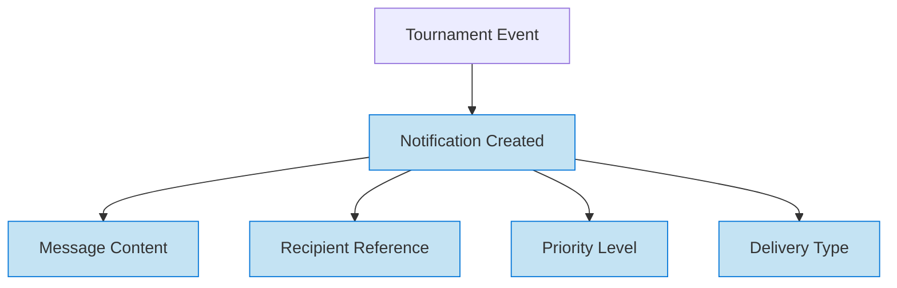

# Communication Domain

tag: communication, domain, notification, messaging

## Overview

The Communication domain provides a simple, focused framework for managing notifications within the Tournament Organizer system. It defines the data structures and models needed to create, store, and track notification messages that inform users about tournament-related events and updates.

## Purpose

- Enable standardized notification management across the tournament system
- Provide consistent data models for storing notification information
- Support various notification types and priority levels
- Track notification lifecycle and delivery status

## Structure

The domain consists of a single template entity for notification management:

| Entity | Description |
|--------|-------------|
| [Notification](notification.md) | Template entity for messages and alerts sent to tournament participants and organizers |

## Example

### Simple Notification Structure

This diagram shows the basic structure of the Communication domain. When a tournament event occurs, a notification is created with essential information: message content, recipient reference, priority level, and delivery type. The domain focuses purely on the notification data model without handling delivery mechanisms or recipient management.

## See Also

- [Notification](notification.md)
- [Tournament Domain](../tournament/README.md)
- [Foundation Domain](../foundation/README.md)
