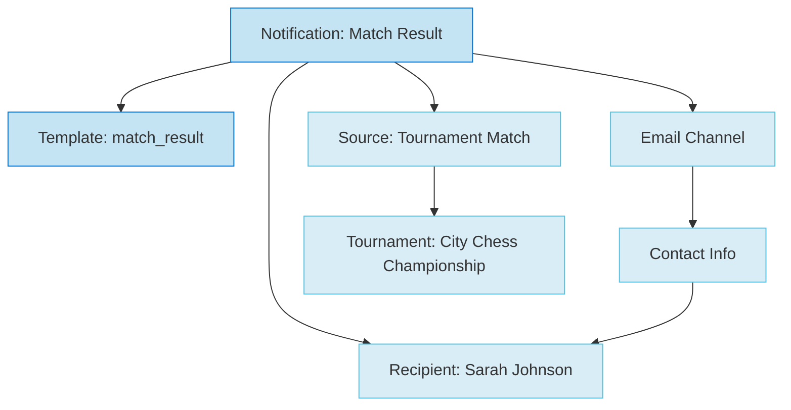

---
tags:
  - communication
  - domain
  - notification
  - messaging
  - template
---

# Communication Domain

## Overview

The Communication domain manages all notification and messaging aspects of the Tournament Organizer system. It provides comprehensive frameworks for creating, managing, and delivering notifications to users and systems, supporting both direct notifications and template-based communication.

## Purpose

This domain focuses on data structures and models for storing communication-related information, while actual delivery processes are managed in the Process domain. It uses a template-based approach for standardized notification formats and supports multiple communication channels.

## Structure

### Core Models

- **[Notification](notification.md)**: Template entity for messages and alerts with template-based functionality
- **[Digital Channel](../media/digital_channel.md)**: Value object for digital communication channels (embedded in Contact Information)

### Related Models

- **[Human Profile](../identity/profile/human.md)**: Recipients of notifications
- **[Contact Information](../identity/contact_information.md)**: Contact details and digital channels

## Example

### Communication Flow Diagram



This diagram illustrates how a match result notification flows through the communication system. The notification uses a predefined template (match_result), is delivered to a specific recipient (Sarah Johnson) via their preferred digital channel (email), and originates from a tournament match event. This structure enables personalized, template-based communication that maintains consistency while allowing customization for different notification types and recipients.

### Notification Template Example


```json
{
  "template_id": "tournament_start_notice",
  "title": "{{tournament_name}} is starting soon!",
  "message": "Hello {{recipient_name}}, your tournament {{tournament_name}} begins on {{start_date}} at {{venue_name}}. Please arrive {{arrival_time_minutes}} minutes early.",
  "priority": "Normal",
  "type": "Email"
}
```


This template demonstrates variable substitution, allowing a single template to generate personalized notifications for multiple recipients and tournaments while maintaining consistent messaging structure.

## See Also

- **Communication Models**: [Notification](notification.md), [Digital Channel](../media/digital_channel.md)
- **Related Domains**: [Identity](../identity/README.md), [Media](../media/README.md), [Process](../process/README.md)
- **Source Entities**: [Tournament](../tournament/README.md), [Schedule](../schedule/README.md)
