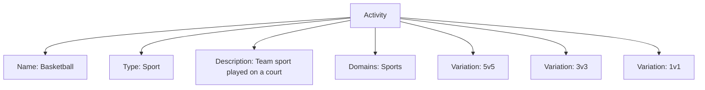
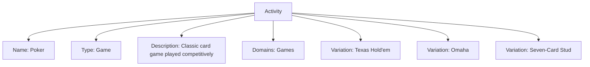

---
tags:

  - activity
  - template-entity
  - sport
  - game
  - variation

---

# Activity (Template Entity)

## Overview

An Activity is a reusable template that describes the sport/game itself: what is played and the standard ways it can be played (its variations). It is independent of any single tournament or discipline. A [Discipline](../discipline.md) references exactly one Activity to organize competition around it.

Each Activity references one or more [Domains](domain.md) (e.g., Sports, Games, Arts) for classification and discovery.

## Structure

This template entity includes standard attributes from the [Base Entity](../../foundation/base_entity.md).

| Attribute | Description                         | Type                         | Required | Example                             |
|-----------|-------------------------------------|------------------------------|----------|-------------------------------------|
| Name      | The name of the activity            | String                       | Yes      | 5v5 Basketball, Texas Hold'em       |
| Type      | Classification of the activity      | [Type](../../classification/type.md) | Optional | Sport, Game, Skill, Race            |
| Description | Description of the activity       | String                       | Optional | Team sport played on a court        |
| Domains   | Domains associated with this activity | List[[Domain](domain.md)]  | Yes      | [Sports], [Games]                   |
| Variations | Standard ways the activity can be played | List[[Variation](variation/variation.md)] | Optional | [5v5, 3v3], [Texas Hold'em, Omaha] |

Note: Attributes such as format, duration, location, capacity, requirements, and status are defined at the Discipline or Stage level to avoid redundancy. The Activity template focuses solely on describing the activity itself.

## Example

### Example: Basketball Activity and Variations

This example covers all Activity attributes: Name (Basketball), Type (Sport), Description, Domains (Sports), and Variations (5v5, 3v3, 1v1). A Discipline organizes competition around the Activity, and each Stage selects which Activity Variation applies.

### Example: Poker Activity and Variations

This example covers all Activity attributes for a non-sport: Name (Poker), Type (Game), Description, Domains (Games), and common Variations. Tournament-specific rules (e.g., blinds, levels, tiebreakers) are configured at the Discipline/Stage level.

## See Also

- [Discipline](../discipline.md)
- [Domain](domain.md)
- [Variation](variation/variation.md)
