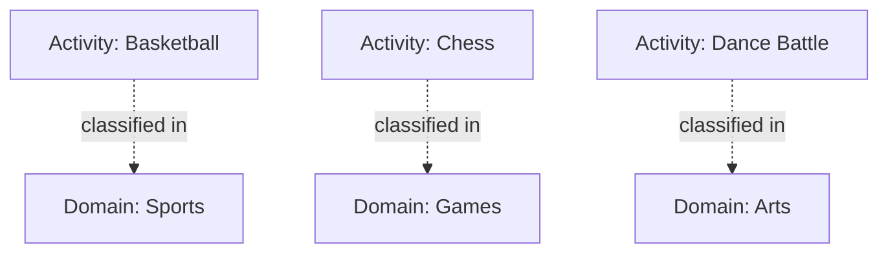

---
tags:

  - domain
  - template-entity
  - classification
  - activity
  - grouping

---

# Domain (Template Entity)

## Overview

A Domain is a lightweight classification tag used to group similar Activities (for example: Sports, Games, Arts). It helps discovery, search, and organization. Operational details (rules, equipment, participants, duration) belong to Activity or Stage—not to the Domain.

---

## **Attributes**

This template includes the standard attributes from the [Base Entity](../../foundation/base_entity.md).

| Attribute       | Description                               | Type                                  | Required | Notes / Example                           |
| --------------- | ----------------------------------------- | ------------------------------------- | -------- | ----------------------------------------- |
| **Name**        | The name of the domain.                   | String                                | Yes      | `Sports`, `Games`, `Arts`                 |
| **Description** | Short description of the domain’s scope.  | String                                | Optional | `Physical sports`, `Tabletop & video`     |
| **Category**    | Optional higher-level grouping.           | [Type](../../classification/type.md)  | Optional | `Physical`, `Mental`, `Mixed`             |

---

## **Relationships**

- An [Activity](activity.md) references one or more Domains for classification.
- Domains do not own rules, equipment, or participants; those belong to Activity or Stage.

---

## **Considerations**

- Keep Domains broad and stable; refine details at the Activity level.
- Use Domains to power search, discovery, and navigation.
- Avoid embedding operational details in the Domain; link Activities instead.

---

<!-- References intentionally omitted as per documentation standards. -->

## Example

### Example: Activity Classification with Domains

This diagram shows how Activities are tagged with Domains for discovery and navigation. Domains act as lightweight classifiers (Sports, Games, Arts) and do not own rules or participants—those belong to Activity, Discipline, or Stage.

## See Also

- [Activity](../../discipline/activity/activity.md)
- [Discipline](../../discipline/discipline.md)
- [Category](../../classification/category.md)
- [Type](../../classification/type.md)
