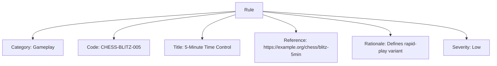

# Rule (Template Entity)

## Overview

A Rule defines a reusable directive that governs gameplay, eligibility, procedure, or conduct. Rules are templates that can be embedded into same-domain models (e.g., a Variation’s Rule Modifications) or copied into instances elsewhere.

This template includes standard attributes from the [Base Entity](../../../foundation/base_entity.md).

---

## Purpose

- Standardize how constraints and directives are expressed across disciplines and activities.
- Allow Variations to embed the exact gameplay changes they introduce.
- Enable reuse across tournaments without duplicating text.

---

## Structure

| Attribute            | Description                                                                                           | Type        | Required | Notes / Example                                                                 |
| -------------------- | ----------------------------------------------------------------------------------------------------- | ----------- | -------- | ------------------------------------------------------------------------------- |
| Category             | Top-level grouping of the rule                                                                        | String      | Yes      | Eligibility, Gameplay, Sportsmanship, Equipment, Procedure                       |
| Code                 | Short code for referencing the rule                                                                   | String      | Optional | SPRT-01, ELIG-MIN-AGE, II.a.1                                                    |
| Title                | Clear, human-readable title                                                                            | String      | Yes      | Minimum Age Requirement, No-Advantage at Deuce                                   |
| Description          | Full text of the rule                                                                                 | Text        | Cond.    | Required if Reference is not provided                                            |
| Reference            | External source (URL/identifier)                                                                      | String      | Cond.    | Required if Description is not provided                                          |
| Rationale            | Why the rule exists                                                                                   | Text        | Optional | Safety, fairness, clarity                                                        |
| Target Audiences     | Cross-domain audiences the rule applies to                                                            | List[UUID]  | Optional | UUIDs of Organization/TargetAudience (cross-domain; reference by ID)             |
| Conditions           | Context in which the rule applies                                                                      | String      | Optional | During Competition, Hot Weather, Indoor Venues                                    |
| Severity             | Impact level for violations                                                                            | Enum        | Optional | Low, Medium, High, Critical                                                       |
| Consequences         | Outcomes for violations                                                                                | Text        | Optional | Verbal Warning, Point Deduction, Disqualification                                 |

---

## Example

### Example: Gameplay — No-Advantage at Deuce

```mermaid
graph TD
  R[Rule]
  R --> CAT[Category: Gameplay]
  R --> CODE[Code: TENNIS-NA-001]
  R --> T[Title: No-Advantage at Deuce]
  R --> D[Description: At deuce, a single sudden-death point determines the game winner.]
  R --> RAT[Rationale: Speeds up play and reduces match length variability.]
  R --> SEV[Severity: Medium]
  R --> CON[Consequences: Point awarded / replay as applicable]
  R --> CND[Conditions: Applies in all sets unless superseded by tiebreak rules]
  R --> TA[Target Audiences: Players, Officials (UUIDs)]
```

This diagram covers all Rule attributes including Category, Code, Title, Description/Reference, Rationale, Target Audiences, Conditions, Severity, and Consequences.

### Example: Timing — 5-Minute Blitz (Reference)



---

## Notes

- Exactly one of Description or Reference is required (not both).
- Target Audiences are cross-domain; reference by UUIDs (Organization/TargetAudience).
- When used within a Variation, the Rule is embedded (same-domain embedding policy).

---

## See Also

- [Variation](variation.md)
- [Activity](../activity.md)
- [Discipline](../../discipline.md)
- [Target Audience](../../../organization/target_audience.md)
- [Code of Conduct](../../../code_of_conduct/code_of_conduct.md)
