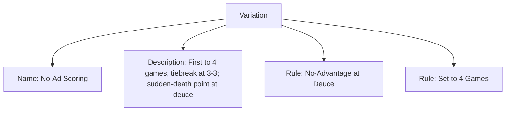
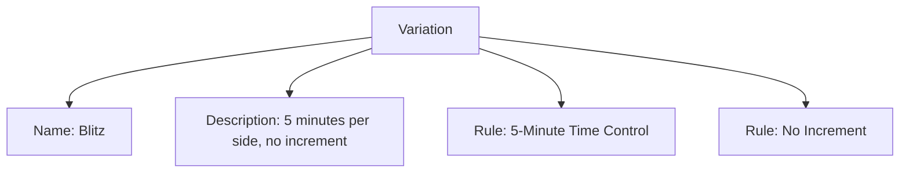

# Variation (Template Entity)

## Overview

A Variation defines a specific way to play or score the underlying Activity by modifying rules or parameters (e.g., No-Ad Scoring, Blitz, Shortened Halves, House Rules Set A). Variations are reusable and can be referenced by an Activity and selected by a Stage.

---

## Purpose

- Capture standardized ways to play an Activity without duplicating base rules.
- Allow Disciplines/Stages to select a Variation appropriate to each phase of competition.
- Enable reusability across tournaments while keeping gameplay definition separate from competition structure.

---

## Structure

This template entity includes standard attributes from the [Base Entity](../../../foundation/base_entity.md).

| Attribute              | Description                                                                   | Type       | Required | Notes / Example                                                                 |
| ---------------------- | ----------------------------------------------------------------------------- | ---------- | -------- | ------------------------------------------------------------------------------- |
| Name                   | Specific name of the variation                                                | String     | Yes      | `No-Ad Scoring`, `Blitz`, `Shortened Halves`, `House Rules Set A`               |
| Description            | What changes from the base rules and why                                      | String     | Yes      | `First to 4 games wins set, tiebreak at 3-3.`, `5 minutes per side, no increment.` |
| Rule Modifications     | Embedded rules that define the variation’s unique characteristics             | List[[Rule](rule.md)] | Optional | See Rule                                          |

---

## Example

### Example: Tennis No-Ad Scoring

This diagram represents all Variation attributes: Name, Description, and Rule Modifications (embedded Rules). The rules here remove advantage scoring at deuce and shorten sets to four games with a tiebreak at 3–3.

### Example: Blitz Variant (Chess)

This second example also covers all attributes and shows a rapid-play variant by embedding the relevant rules for time control and increment.

---

## Notes

- Embed Rule Modifications: Variations embed a list of [Rule](rule.md) documents. Cross-domain references (e.g., identity, classification) must appear inside a Rule and be referenced by UUID.
- Scope boundaries: Use Variations to change how an Activity is played (rules, scoring, timing), not structure. Team sizes/rosters belong to [Team Format](../../stage/team_format.md). Match units and tiebreak logic belong to [Match System](../../stage/match_system/match_system.md).
- Selection: An Activity can offer multiple Variations. A Stage may select one appropriate Variation for a given phase; if none is selected, assume base Activity rules.
- Stability: Prefer creating a new Variation for material changes instead of mutating existing ones, to preserve historical accuracy in past tournaments.
- Naming: Use descriptive, organizer-friendly names (e.g., “No-Ad Scoring”, “Short Sets”) rather than opaque labels.

## See Also

- [Rule](rule.md)
- [Activity](../activity.md)
- [Stage](../../stage/stage.md)
- [Match System](../../stage/match_system/match_system.md)
- [Team Format](../../stage/team_format.md)
- [Stage Format](../../stage/stage_format.md)
- [Discipline](../../discipline.md)
- [Tournament](../../../tournament/tournament.md)
