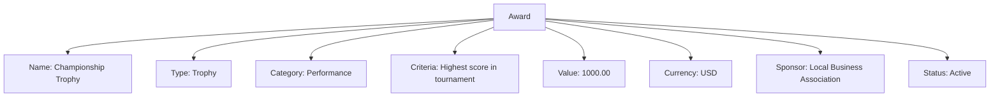

# **Award** (Data Model - Template Entity)

## **Introduction**

An **Award** Template Entity represents a recognition or prize that can be given to participants, teams, or individuals within the tournament system. Awards are managed by disciplines and provide motivation, achievement tracking, and recognition.

---

## **Attributes**

**Note:** This Template Entity includes the standard attributes (`ID`, `Status`, `CreatedAt`, `LastUpdatedAt`, etc.) defined in the [Base Entity](../foundation/base_entity.md).

| Attribute       | Description                                       | Type     | Required | Example                                                                |
| --------------- | ------------------------------------------------- | -------- | -------- | ---------------------------------------------------------------------- |
| **Name**        | The name of the award.                            | String   | Yes      | `"Championship Trophy"`, `"Most Valuable Player"`                   |
| **Type**        | The type of award.                                | String   | Optional | `"Trophy"`, `"Medal"`, `"Certificate"`                              |
| **Description** | Description of the award and criteria.            | String   | Optional | `"Awarded to the tournament champion"`                                |
| **Category**    | The category of the award.                        | String   | Optional | `"Performance"`, `"Sportsmanship"`, `"Participation"`               |
| **Criteria**    | The criteria for winning the award.               | String   | Optional | `"Highest score in tournament"`, `"Best team spirit"`                |
| **Value**       | The monetary or symbolic value of the award.      | Decimal  | Optional | `1000.00`, `500.00`, `0.00`                                            |
| **Currency**    | The currency of the award value.                  | String   | Optional | `"USD"`, `"EUR"`, `"CAD"`                                            |
| **Sponsor**     | The sponsor of the award.                         | String   | Optional | `"Local Business Association"`, `"Sports Equipment Co"`              |
| **Status**      | The status of the award.                          | String   | Optional | `"Active"`, `"Inactive"`, `"Discontinued"`                           |

---

## **Example**

---

## **See Also**

- [Discipline](../discipline/discipline.md)
- [Discipline README](../discipline/README.md)
- [Team](../team.md)
- [User](../identity/account/account.md)
