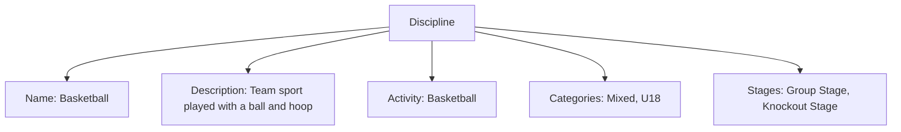
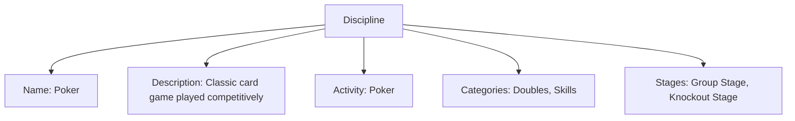

---
tags:
  - discipline
  - sport
  - activity
  - template
  - rule
  - stage
---

# Discipline (Template Entity)

## Overview

A Discipline organizes a competition around exactly one Activity. It does not redefine how the game is played—those details live in the separate [Activity](activity/activity.md) model. The Discipline simply references the Activity and adds competition-specific context like Categories and Stages.

- Activity describes the sport/game itself and its Variations (e.g., 5v5, Blitz, No-Ad). It also declares its [Domains](activity/domain.md).
- Discipline points to that Activity, lists Categories (if any), and lays out the Stages used in competition.
- Each Stage explicitly selects which [Activity Variation](activity/variation/variation.md) applies.

This separation keeps the "what is played" (Activity) apart from "how we run the competition" (Discipline and Stages).

## Purpose

- Enable standardized definition and organization of sports and activities.
- Support rule management, eligibility, and classification.
- Facilitate logical grouping and flexible competition formats.

## Structure

This template entity includes standard attributes from the [Base Entity](../foundation/base_entity.md).

| Attribute    | Description                                         | Type        | Required | Example                                         |
|--------------|-----------------------------------------------------|-------------|----------|-------------------------------------------------|
| Name         | Name of the discipline                              | String      | Yes      | Basketball, Poker, Soccer, Tennis               |
| Description  | Explanation of the discipline                       | String      | Optional | Team sport played with a ball and hoop          |
| Activity     | Reference to the associated Activity template        | [Activity](activity/activity.md)   | Yes      | 5v5 Basketball, Texas Hold'em                   |
| Categories   | List of associated Category templates               | List[[Category](../classification/category.md)] | Optional | [Mixed, Doubles, U18, Skills]                   |
| Stages       | List of associated Stage templates                  | List[[Stage](stage/stage.md)] | Optional | [Group Stage, Knockout Stage]                   |
<!-- Status is provided by the Base Entity and is not listed here. -->

## Example

### Example 1: Basketball Discipline

This example represents all Discipline attributes: Name, Description, Activity, Categories, and Stages. The Activity is Basketball; specific Activity Variations (e.g., 5v5) are selected by each Stage. Gameplay details live in Activity/Stage.

### Example 2: Poker Discipline

This example represents all Discipline attributes. It references the Activity (Poker), includes Categories (Doubles, Skills), and defines Stages. Each Stage will select the applicable Activity Variation (e.g., Texas Hold'em). Details such as equipment, participants, duration, and rules are modeled in Activity/Stage to avoid redundancy.

## See Also

- [Activity](activity/activity.md)
- [Stage](stage/stage.md)
- [Variation](activity/variation/variation.md)
- [Rule](activity/variation/rule.md)
- [Award](award.md)
- [Discipline README](../README.md)
- [Category](../classification/category.md)
- [Tournament](../tournament/tournament.md)
- [Team](../team/team.md)
