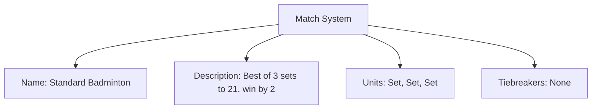
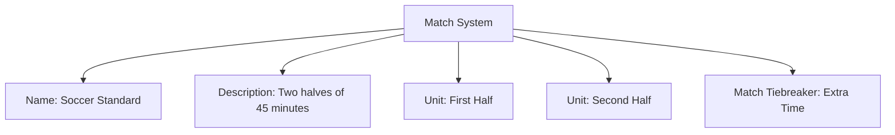

---
tags:
  - match-system
  - template-entity
  - match-structure
  - tiebreakers
  - composition
---

# Match System (Template Entity)

## Overview

Match System defines how a match is composed from one or more Match Units and which match-level tiebreakers apply (e.g., Best-of-3 sets, two halves, single game to 21).

---

## Structure

This template entity includes standard attributes from the [Base Entity](../../../foundation/base_entity.md).

### Attributes

| Attribute    | Description                                                                                                 | Type            | Required | Notes / Example                                                                 |
| ------------ | ----------------------------------------------------------------------------------------------------------- | --------------- | -------- | ------------------------------------------------------------------------------- |
| Name         | Name of the match system                                                                                    | String          | Yes      | "Tennis Singles", "Standard Badminton", "Darts 501"                            |
| Description  | Human-readable description of the system                                                                    | Text            | Yes      | "Best of 3 sets to 21 points, win by 2 or first to 30"                          |
| Units        | Ordered list of embedded [Match Unit](match_unit/match_unit.md) composing the match                         | List[Match Unit] | Yes    | e.g., [Set, Set, Set]                                                            |
| Tiebreakers  | Ordered list of embedded [Match Tiebreaker](match_tiebreaker.md) applied at match level                     | List[Match Tiebreaker] | No | e.g., Extra Time, Penalty Shootout                                               |

---

## Example

This diagram represents all Match System attributes: Name, Description, Units, and Tiebreakers.

### Example: Soccer Two Halves with Extra Time

## See Also

- [Match Tiebreaker](match_tiebreaker.md)
- [Match Unit](match_unit/match_unit.md)
- [Stage Format](../stage_format.md)
- [Stage](../stage.md)
- [Discipline](../../../discipline/discipline.md)
- [Activity](../../../discipline/activity/activity.md)
- [Tournament](../../../tournament/tournament.md)
- [Team](../../../team/team.md)

---
