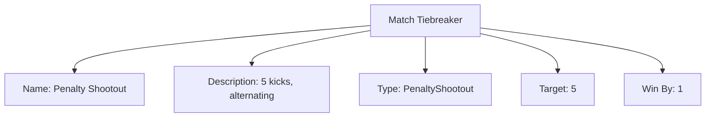

# Match Tiebreaker (Entity)

## Overview

Match Tiebreaker defines a procedure to determine a winner when a match ends in a tie (e.g., Extra Time, Penalty Shootout, Sudden Death).

---

## Structure

This entity includes standard attributes from the [Base Entity](../../../foundation/base_entity.md).

### Attributes

| Attribute   | Description                                              | Type   | Required | Notes / Example                                      |
| ----------- | -------------------------------------------------------- | ------ | -------- | ---------------------------------------------------- |
| Name        | Name of the tiebreaking procedure                        | String | Yes      | "Extra Time (2x15 min)", "Penalty Shootout (5 Kicks)" |
| Description | Explanation of the procedure                              | Text   | No       | "Two 15-minute periods of extra time..."             |
| Type        | Kind of mechanism                                        | String | Yes      | ExtraTime, PenaltyShootout, SuddenDeath, Tiebreaker, ManualDecision |
| Duration    | Duration if applicable                                   | Time   | No       | 00:30:00                                              |
| Target      | Target value if applicable                               | Number | No       | 7                                                     |
| Win By      | Required margin if applicable                            | Number | No       | 2                                                     |

---

## Example

This diagram represents all Match Tiebreaker attributes: Name, Description, Type, Target, and Win By. Duration is shown when applicable.

## See Also

- [Match System](match_system.md)
- [Match Unit](match_unit/match_unit.md)
- [Stage Tiebreaker](../../../discipline/stage/stage_tiebreaker.md)
- [Stage](../../../discipline/stage/stage.md)
- [Discipline](../../../discipline/discipline.md)
- [Tournament](../../../tournament/tournament.md)
- [Team](../../../team/team.md)

---
