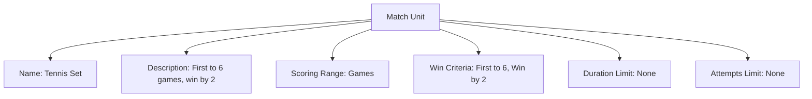

# Match Unit (Template Entity)

## Overview

Match Unit defines a discrete, measurable segment of a match (e.g., set, inning, frame, leg) that can be scored and evaluated independently.

---

## Structure

This template entity includes standard attributes from the [Base Entity](../../../../foundation/base_entity.md).

### Attributes

| Attribute        | Description                                                                                 | Type                | Required | Notes / Example                              |
| ---------------- | ------------------------------------------------------------------------------------------- | ------------------- | -------- | -------------------------------------------- |
| Name             | Name of the unit                                                                            | String              | Yes      | "Tennis Set", "Baseball Inning", "Darts Leg" |
| Description      | Description of the unit’s rules                                                              | Text                | Yes      | "First to 6 games, win by 2"                 |
| Scoring Range    | Embedded [Scoring Range](scoring_range.md) that defines valid scores and type                | Scoring Range       | Yes      |                                                |
| Win Criteria     | Ordered list of embedded [Win Criterion](win_criterion.md) defining how to win               | List[Win Criterion] | Yes      |                                                |
| Duration Limit   | Time duration limit (ISO 8601), if applicable                                               | Duration            | No       | PT20M, PT45M                                  |
| Attempts Limit   | Fixed number of attempts/ends/rounds, if applicable                                         | Integer             | No       | 6, 10                                         |

---

## Example

This diagram represents all Match Unit attributes: Name, Description, Scoring Range, Win Criteria, Duration Limit, and Attempts Limit.

### Notes

- Win Criteria are evaluated in the order listed. Do not define a separate sequence field.
- Duration Limit is ISO 8601 (e.g., PT20M). Attempts Limit is an integer when applicable.

## See Also

- [Scoring Range](scoring_range.md)
- [Win Criterion](win_criterion.md)
- [Match System](../match_system.md)
- [Stage](../../stage.md)
- [Discipline](../../../discipline.md)
- [Score](../../../../schedule/score.md)
- [Tournament](../../../../tournament/tournament.md)

---
