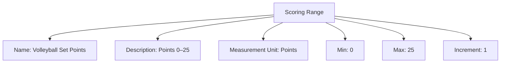

# Scoring Range (Template Entity)

## Overview

Scoring Range defines valid measurement values and the score type for a Match Unit (e.g., points 0–25, discrete sequence 0/15/30/40/Adv/Game, time in seconds).

---

## Structure

This template entity includes standard attributes from the [Base Entity](../../../../foundation/base_entity.md).

### Attributes

| Attribute            | Description                                                                      | Type    | Required | Notes / Example                                                                                                            |
| -------------------- | -------------------------------------------------------------------------------- | ------- | -------- | -------------------------------------------------------------------------------------------------------------------------- |
| Name                 | Name of the scoring range                                                         | String  | Yes      | "Volleyball Set Points", "Tennis Game Score", "F1 Lap Time"                                                             |
| Description          | Explanation of the scoring rules and the score type                               | Text    | Yes      | "Points 0–25", "Time (seconds)"                                                                                           |
| Measurement Unit     | Reference to the measurement unit defining the fundamental score type              | UUID    | Yes      | Points, Seconds, Meters (see [Unit](../../../../classification/measurement/unit.md))                                       |
| Min                  | Minimum value (continuous)                                                         | Decimal | No       | 0.0                                                                                                                        |
| Max                  | Maximum value (continuous)                                                         | Decimal | No       | 25.0                                                                                                                       |
| Increment            | Allowed increment (continuous)                                                     | Number  | No       | 1.0                                                                                                                        |
| Sequence             | Ordered discrete values (discrete)                                                | List    | No       | [0, 15, 30, 40, Adv, Game]                                                                                                  |

---

## Example

This diagram represents all Scoring Range attributes. Use Sequence instead of Min/Max/Increment when defining discrete values.

## See Also

- [Match Unit](match_unit.md)
- [Win Criterion](win_criterion.md)
- [Unit](../../../../classification/measurement/unit.md)
- [System](../../../../classification/measurement/system.md)
- [Score](../../../../schedule/score.md)
- [Match System](../match_system.md)
- [Discipline](../../../../discipline/discipline.md)

---
