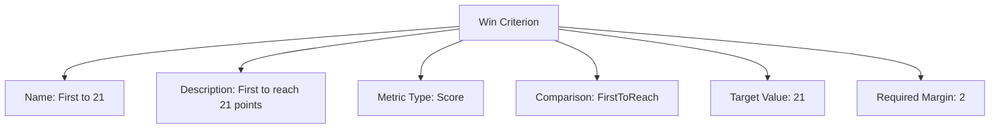

# Win Criterion (Template Entity)

## Overview

Win Criterion defines how to determine a winner for a Match Unit (e.g., first to 21, win by 2, exact target, time limit).

---

## Structure

This template entity includes standard attributes from the [Base Entity](../../../../foundation/base_entity.md).

### Attributes

| Attribute        | Description                                                                 | Type    | Required | Notes / Example                          |
| ---------------- | --------------------------------------------------------------------------- | ------- | -------- | ---------------------------------------- |
| Name             | Name of the criterion                                                       | String  | Yes      | "Win by 2 Points", "First to 21 Points" |
| Description      | Explanation of how the criterion applies                                    | String  | Yes      | "Must lead by 2 points to win"          |
| Metric Type      | Primary metric used                                                         | String  | Yes      | Score, Time, Goals, Sets, Attempts       |
| Comparison       | Comparison method                                                            | String  | Yes      | FirstToReach, ExactValue, GreaterThan, LessThan, MarginOrHigher, NoMoreThan |
| Target Value     | The target value to compare against                                         | Number  | Optional | 21, 30, 6                                |
| Required Margin  | Minimum difference required                                                 | Number  | Optional | 2, 1                                     |

Note: Ordering is determined by the Match Unit's Win Criteria list; a separate Sequence field is not required here.

---

## Example

This diagram represents all Win Criterion attributes: Name, Description, Metric Type, Comparison, Target Value, and Required Margin. Ordering comes from the Match Unit's ordered list of Win Criteria.

## See Also

- [Match Unit](match_unit.md)
- [Scoring Range](scoring_range.md)
- [Match System](../match_system.md)
- [Score](../../../../schedule/score.md)
- [Stage](../../stage.md)
- [Discipline](../../../../discipline/discipline.md)
- [Tournament](../../../../tournament/tournament.md)

---
