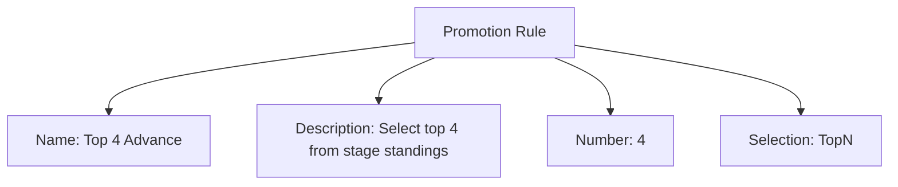
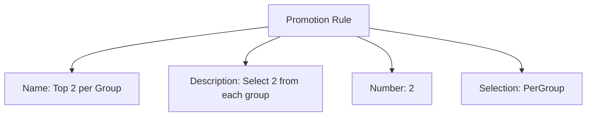

---
tags:

  - promotion-rule
  - template-entity
  - advancement
  - stage-progression
  - selection

---

# Promotion Rule (Template Entity)

## Overview

A Promotion Rule defines how teams advance from one [Stage](stage.md) to the next. It is applied at the stage level and selects which teams progress based on stage standings (after tie-breaking).

Stage rankings and ties are determined by [Stage Tiebreaker](stage_tiebreaker.md). The Promotion Rule uses those ordered standings to choose advancing teams.

---

## Structure

This template entity includes standard attributes from the [Base Entity](../../foundation/base_entity.md).

### Attributes

| Attribute       | Description                                                      | Type   | Required | Notes / Example                                                                  |
| --------------- | ---------------------------------------------------------------- | ------ | -------- | -------------------------------------------------------------------------------- |
| **Name**        | A unique, human-readable name for the promotion rule template.   | String | Yes      | Example: "Top 4 Teams from Group", "Top 2 from Each Group", "Wildcard Selection" |
| **Description** | A detailed explanation of the rule, its context, or any nuances. | Text   | No       | Example: "Advances the top 4 teams based on final group stage standings."        |
| **Number**      | The number of teams that will advance from this stage.           | Number | Yes      | Example: `4` (4 teams advance), `8` (8 teams advance)                            |
| **Selection**   | The method used to select teams for advancement.                 | String | Yes      | Enum: "TopN", "BestOfGroups", "PerGroup", "Winners", "Losers"                    |

<!-- Relationships and detailed considerations omitted per documentation style. -->

## Example

### Example: TopN Promotion

This diagram represents all Promotion Rule attributes: Name, Description, Number, and Selection. It promotes the top 4 teams from the final stage standings.

### Example: Per-Group Promotion

This example also represents all attributes. It advances two teams per group, based on group standings after tiebreakers.

### Notes

- Number must be a positive integer and cannot exceed the total teams considered by the rule (e.g., per group or across groups).
- Selection determines the pool: TopN (global), PerGroup (each group), Winners/Losers (bracket outcome based); document ties and wildcards clearly.
- Promotion is applied after all configured Stage Tiebreakers.

## See Also

- [Stage](../../discipline/stage/stage.md)
- [Stage Tiebreaker](../../discipline/stage/stage_tiebreaker.md)
- [Points System](../../discipline/stage/points_system.md)
- [Seeding System](../../discipline/stage/seeding_system.md)
- [Stage Format](../../discipline/stage/stage_format.md)
- [Variation](../activity/variation/variation.md)
- [Standing](../../standing/standing.md)
- [Team](../../team/team.md)
- [Tournament](../../tournament/tournament.md)

---
