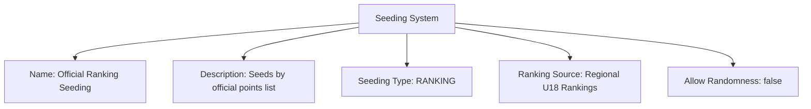
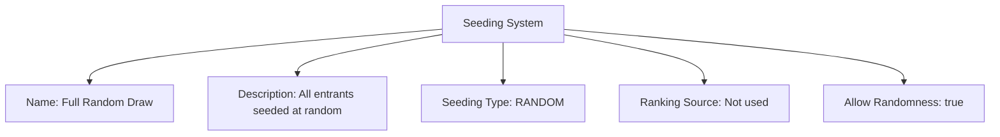

---
tags:
  - seeding-system
  - template-entity
  - seeding
  - brackets
  - fairness
---

# Seeding System (Template Entity)

## Overview

A Seeding System defines how initial seeds are assigned to teams within a Stage or tournament. It specifies the method (e.g., performance, ranking, random) and any inputs required to produce fair, balanced brackets or groups.

## Purpose

- Standardize team seeding for fairness and repeatability.
- Support ranking-based, performance-based, random, or manual seeding methods.
- Allow different stages to select different seeding approaches as needed.

---

## Structure

This template entity includes standard attributes from the [Base Entity](../../foundation/base_entity.md).

### Attributes

| Attribute            | Description                                                                                                      | Type    | Required | Notes / Example                                                                                                                        |
| -------------------- | ---------------------------------------------------------------------------------------------------------------- | ------- | -------- | -------------------------------------------------------------------------------------------------------------------------------------- |
| **Name**             | A descriptive name for the seeding system.                                                                       | String  | Yes      | `"Performance-Based Seeding"`, `"Random Draw"`, `"Ranking Points System (Official)"`                                                   |
| **Description**      | A detailed explanation of how the seeding system works, including its logic and criteria.                        | String  | Yes      | `"Seeds teams based on total points accumulated in the last 3 qualifying events."`, `"Assigns seeds randomly to all entrants."` |
| **Seeding Type**     | Categorizes the primary method used (e.g., performance, random, manual, ranking-based).                          | Enum    | Yes      | `PERFORMANCE`, `RANDOM`, `MANUAL`, `RANKING`                                                                                           |
| **Ranking Source**   | Optional reference to an external or internal [Ranking](../../ranking/ranking.md) list used as input. | UUID    | Optional | `ranking-uuid-regional-u18` (If Seeding Type is RANKING)                                                                               |
| **Allow Randomness** | Indicates if a random element can be introduced (e.g., to break ties or for full random seeding).                | Boolean | Yes      | `true` (for tie-breaking in performance seeding), `true` (for RANDOM type), `false` (for strict ranking)                               |

<!-- Relationships and detailed considerations omitted per documentation style. -->

## Example

### Example: Ranking-Based Seeding

This example covers all attributes of the Seeding System: Name, Description, Seeding Type, Ranking Source, and Allow Randomness. Seeds are assigned strictly by the given ranking list.

### Example: Random Draw Seeding

This example also covers all attributes and illustrates a random approach. The ranking source is not used, and randomness is enabled to produce the draw.

## See Also

- [Stage](../../discipline/stage/stage.md)
- [Promotion Rule](../../discipline/stage/promotion_rule.md)
- [Points System](../../discipline/stage/points_system.md)
- [Ranking](../../ranking/ranking.md)
- [Seed](../../team/seed.md)
- [Standing](../../standing/standing.md)
- [Tournament](../../tournament/tournament.md)
- [Team](../../team/team.md)

---

### Notes

- Ranking Source must be provided only when Seeding Type is RANKING.
- Allow Randomness should be true for RANDOM and false for strict RANKING; for PERFORMANCE, use it only for tie-breaking.
