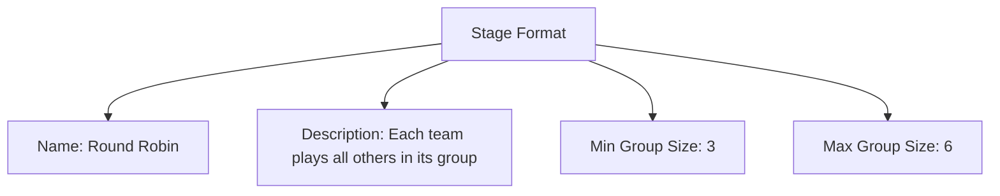
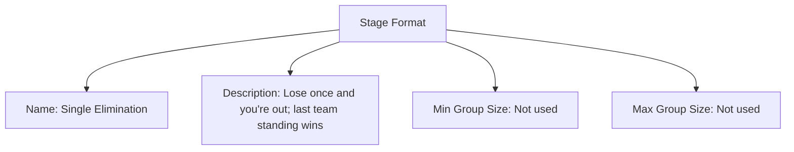

# **Stage Format** (Template Entity)

## Overview

A **Stage Format** template defines a reusable blueprint for structuring competition within a [Stage](stage.md). It
specifies how teams are grouped, matched, and advance through the stage.

As a template entity, it’s referenced by stages to ensure consistent tournament progression.

---

## Structure

This template entity includes standard attributes from the [Base Entity](../../foundation/base_entity.md).

| Attribute          | Description                                                                                                 | Type    | Required | Notes / Example                                                                                    |
| ------------------ | ----------------------------------------------------------------------------------------------------------- | ------- | -------- | -------------------------------------------------------------------------------------------------- |
| **Name**           | The common name of the stage format.                                                                        | String  | Yes      | `"Single Elimination"`, `"Double Elimination"`, `"Round Robin"`, `"Swiss System"`, `"Group Stage"` |
| **Description**    | A detailed explanation of how this format works, including progression and matching logic.                  | String  | Yes      | `"Teams compete in head-to-head matches; losers are eliminated until one winner remains."`  |
| **Min Group Size** | Minimum number of teams required per group. The system will calculate optimal group sizes above this limit. | Integer | Optional | `3` (minimum 3 teams per group)                                                                    |
| **Max Group Size** | Maximum number of teams allowed per group. The system will calculate optimal group sizes within this limit. | Integer | Optional | `6` (maximum 6 teams per group)                                                                    |

---

<!-- Relationships and detailed considerations omitted per documentation style. -->

## Example

### Example: Round Robin Format

This diagram represents all Stage Format attributes: Name, Description, Min Group Size, and Max Group Size. In a Round Robin format, each group is sized between the minimum and maximum and teams play each other to produce standings.

### Example: Single Elimination Format

This diagram also represents all attributes. Single Elimination typically does not use group sizes; the example marks Min/Max Group Size as Not used to maintain full-attribute coverage while reflecting real-world usage.

### Notes

- When groups are used, ensure Min/Max Group Size are compatible with Stage Min/Max Teams.

## See Also

- [Stage](../../discipline/stage/stage.md)
- [Stage Phase](../../discipline/stage/stage_phase.md)
- [Promotion Rule](../../discipline/stage/promotion_rule.md)
- [Seeding System](../../discipline/stage/seeding_system.md)
- [Points System](../../discipline/stage/points_system.md)
- [Match System](match_system/match_system.md)
- [Variation](../activity/variation/variation.md)
- [Tournament](../../tournament/tournament.md)
- [Team](../../team/team.md)

---
