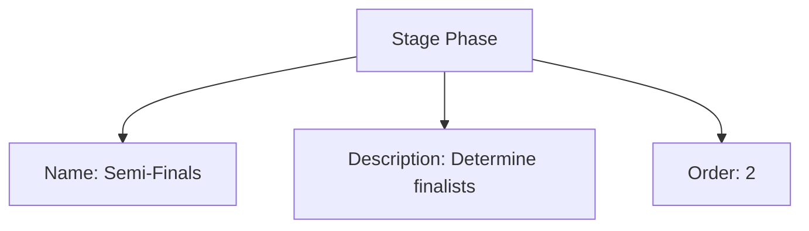

---
tags:
  - stage-phase
  - template-entity
  - tournament-progression
  - sub-stage
  - sequencing
---

# Stage Phase (Template Entity)

## Overview

Stage Phase defines an ordered sub-part of a Stage (e.g., Round 1, Semi-Finals, Bronze Match). It helps structure multi-step stages.

---

## Structure

This template entity includes standard attributes from the [Base Entity](../../foundation/base_entity.md).

### Attributes

| Attribute    | Description                                                    | Type    | Required | Notes / Example                                     |
| ------------ | -------------------------------------------------------------- | ------- | -------- | --------------------------------------------------- |
| Name         | Name of the phase within the stage                            | String  | Yes      | "Semi-Finals", "Grand Final", "Round 1"            |
| Description  | Purpose/rules for this phase                                   | String  | Yes      | "Matches to determine the two finalists."          |
| Order        | Numeric order of this phase within its parent stage (1,2,3)    | Integer | Yes      | 1, 2                                                |

---

## Example

This diagram represents all Stage Phase attributes: Name, Description, and Order.

## See Also

- [Stage](stage.md)
- [Stage Format](stage_format.md)
- [Promotion Rule](promotion_rule.md)
- [Points System](points_system.md)
- [Event](../../schedule/event.md)
- [Tournament](../../tournament/tournament.md)
- [Team](../../team/team.md)

---
