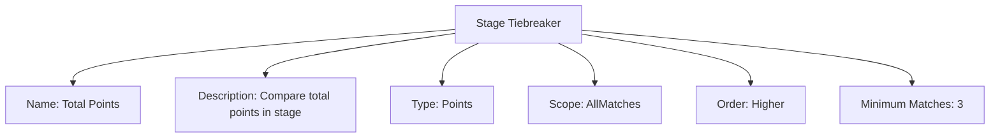
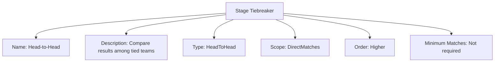

# Stage Tiebreaker (Template Entity)

## Overview

A Stage Tiebreaker defines a single comparison used in a sequence of tiebreaking procedures to order teams in a Stage. It focuses on comparison logic (how to compare), not context (which teams to compare).

Each tiebreaker in the sequence is applied only if the previous comparison resulted in a tie. For example:

1. First compare total points collected during the stage
2. If teams have equal points, compare their head-to-head results
3. If teams are still tied, allow the organizer to decide which team to promote

This model is distinct from the Match Tiebreaker, which determines the winner of a specific match. The Stage Tiebreaker
is used to compare teams' overall performance in the stage to determine which teams advance.

It includes standard attributes from the [Base Entity](../../foundation/base_entity.md).

---

## Structure

This template entity includes standard attributes from the [Base Entity](../../foundation/base_entity.md).

### Attributes

| Attribute           | Description                                                  | Type   | Required | Notes / Example                                                                                                                                |
| ------------------- | ------------------------------------------------------------ | ------ | -------- | ---------------------------------------------------------------------------------------------------------------------------------------------- |
| **Name**            | User-friendly name identifying the comparison criteria.      | String | Yes      | `"Total Points"`, `"Head-to-Head Results"`, `"Manual Decision"`                                                                                |
| **Description**     | (Optional) Textual explanation of the comparison criteria.   | Text   | No       | `"Compare total points collected during the stage"`                                                                                            |
| **Type**            | Identifies the kind of comparison to perform.                | Enum   | Yes      | `Points` (total points collected during the stage), `HeadToHead` (direct match results between teams), `ManualDecision` (organizer's decision) |
| **Scope**           | What matches to consider for the comparison.                 | Enum   | Yes      | `AllMatches`, `GroupMatches`, `DirectMatches`, `LastMatches`, `HomeMatches`, `AwayMatches`                                                     |
| **Order**           | Whether higher or lower values are better.                   | Enum   | Yes      | `Higher`, `Lower`                                                                                                                              |
| **Minimum Matches** | Minimum number of matches required to apply this comparison. | Number | No       | `3` (require at least 3 matches played)                                                                                                        |

<!-- Relationships and detailed considerations omitted per documentation style. -->

## Example

### Example: Points Then Head-to-Head

This diagram represents all Stage Tiebreaker attributes for a points-based comparison. It compares total points across all matches in the stage (higher is better) and requires at least three matches played.

### Example: Head-to-Head Comparison

This example also represents all attributes, focusing on head-to-head results among tied teams (direct matches only). The sequence and execution are defined at the Stage level.

## See Also

- [Stage](../../discipline/stage/stage.md)
- [Match Tiebreaker](match_system/match_tiebreaker.md)
- [Points System](../../discipline/stage/points_system.md)
- [Promotion Rule](../../discipline/stage/promotion_rule.md)
- [Variation](../activity/variation/variation.md)
- [Standing](../../standing/standing.md)
- [Score](../../schedule/score.md)
- [Tournament](../../tournament/tournament.md)
- [Team](../../team/team.md)

---
