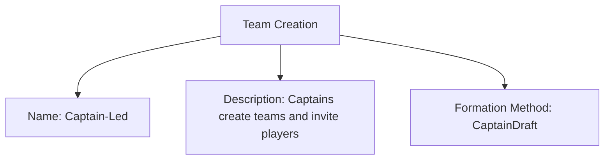

# Team Creation (Template Entity)

## Overview

Team Creation defines how teams are formed or registered within a stage or tournament. It standardizes selection methods, constraints, and formation processes so you can reuse the same approach across events.

---

## Structure

This template entity includes the standard attributes from the [Base Entity](../../foundation/base_entity.md).

### Attributes

| Attribute            | Description                                                   | Type   | Required | Notes / Example                                                                                                                                                                                                                      |
| -------------------- | ------------------------------------------------------------- | ------ | -------- | ------------------------------------------------------------------------------------------------------------------------------------------------------------------------------------------------------------------------------------ |
| **Name**             | Clear and concise title for the team creation configuration.  | String | Yes      | "Standard Team Formation", "Flexible Team Management", "Melee Team Formation", "Round Based Teams"                                                                                                                                 |
| **Description**      | Detailed explanation of the team creation rules and policies. | Text   | Yes      | "Teams can be formed and modified between stages", "Roster members can freely form teams during the event", "Teams reform each round based on field position"                                                                 |
| **Formation Method** | The primary method used for team formation.                   | String | Yes      | Enum values include: PreRegistered, CaptainDraft, SystemAssigned, SelfOrganized, Hybrid, Melee, RoundBased, Auction, SnakeDraft, RandomDraft, SeededDraft, BlindDraft, LockedDraft, TournamentDraft, ProgressiveDraft                |

<!-- Relationships and detailed considerations omitted per documentation style. -->

## Example

### Example: Self-Formed Teams (Captain-Led)

This diagram represents all Team Creation attributes: Name, Description, and Formation Method.

## See Also

- [Stage](../../discipline/stage/stage.md)
- [Team Format](../../discipline/stage/team_format.md)
- [Team](../../team/team.md)
- [Team Member](../../team/roster/roster.md)
- [Account](../../identity/account/account.md)
- [Ranking](../../ranking/ranking.md)
- [Tournament](../../tournament/tournament.md)

---
