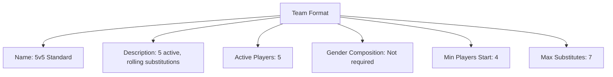
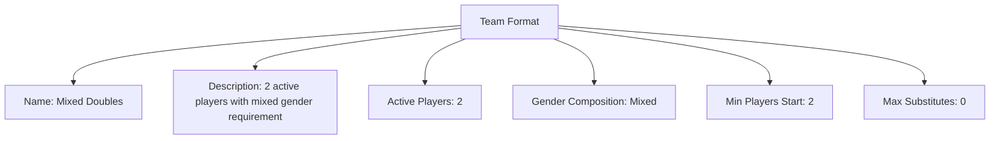

---
tags:
  - team-format
  - template-entity
  - team-structure
  - composition
  - requirements
---

# Team Format (Template Entity)

## Overview

A Team Format defines how teams must be structured during matches within a Stage or tournament context: active players, substitutes, and optional gender composition requirements.

This template is referenced by stages to ensure consistent roster rules.

---

## Structure

This template entity includes standard attributes from the [Base Entity](../../foundation/base_entity.md).

### Attributes

| Attribute              | Description                                                                                                                                         | Type       | Required | Notes / Example                                                                    |
| ---------------------- | --------------------------------------------------------------------------------------------------------------------------------------------------- | ---------- | -------- | ---------------------------------------------------------------------------------- |
| **Name**               | Clear and concise title for the team format.                                                                                                        | String     | Yes      | `"5v5 Standard"`, `"Mixed Doubles"`, `"11-a-side"`                                 |
| **Description**        | Detailed explanation of the team format rules.                                                                                                      | Text       | Yes      | `"Standard 5-a-side format with rolling substitutions"`                            |
| **Active Players**     | Number of players required on field/court during play                                                                                               | Integer    | Yes      | `5` (Basketball), `11` (Soccer), `2` (Doubles)                                     |
| **Gender Composition** | List of required gender identities for active players, referencing [Gender Identity](../../identity/attributes/gender_identity.md) model | List[UUID] | No       | `["550e8400-e29b-41d4-a716-446655440000", "550e8400-e29b-41d4-a716-446655440001"]` (cross-domain reference) |
| **Min Players Start**  | Minimum players required to start a match                                                                                                           | Integer    | Yes      | `4` (5-a-side), `7` (11-a-side)                                                    |
| **Max Substitutes**    | Maximum number of substitutes allowed on bench                                                                                                      | Integer    | Yes      | `7` (Soccer), `5` (Basketball)                                                     |

<!-- Relationships and detailed considerations omitted per documentation style. -->

## Example

### Example: 5v5 Standard Roster

This diagram represents all Team Format attributes for a typical 5v5 roster. It includes Name, Description, Active Players, Gender Composition, Min Players to start, and Max Substitutes.

### Example: Mixed Doubles

This example also represents all attributes and shows a mixed doubles requirement. Gender Composition references Gender Identity definitions in the identity domain when configured.

## See Also

- [Stage](../../discipline/stage/stage.md)
- [Team Creation](../../discipline/stage/team_creation.md)
- [Team](../../team/team.md)
- [Gender Identity](../../identity/attributes/gender_identity.md)
- [Account](../../identity/account/account.md)
- [Event](../../schedule/event.md)
- [Variation](../activity/variation/variation.md)
- [Match System](match_system/match_system.md)
- [Tournament](../../tournament/tournament.md)

---
