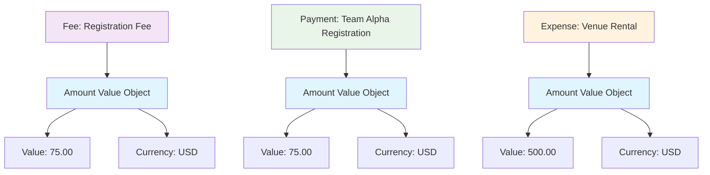

---
tags:

  - finance
  - amount
  - value-object
  - currency
  - money
  - monetary

---

# Amount (Value Object)

## Overview

An Amount value object represents a monetary value with its associated currency in the tournament system. It is an immutable value object that encapsulates the concept of money, ensuring precision, currency consistency, and proper monetary arithmetic throughout the financial domain.

As a value object, Amount has no independent identity and is defined entirely by its attributes. It is always embedded within other entities that need to represent monetary values.

## Purpose

- Provide consistent monetary value representation across the system
- Ensure currency precision and validation in financial calculations
- Maintain immutability for financial data integrity  
- Support standardized currency handling following ISO 4217
- Enable embedded monetary values in financial entities

## Structure

This value object is embedded within other entities and has no independent lifecycle or identity.

### Value Object Attributes

| Attribute | Description | Type | Required | Notes / Example |
|-----------|-------------|------|----------|-----------------|
| **Value** | The numerical value of the amount | Decimal | Yes | `10.50`, `1000.00`, `0.99` |
| **Currency** | The three-letter ISO 4217 currency code | String | Yes | `"USD"`, `"EUR"`, `"GBP"`, `"JPY"` |

## Example

This example shows Amount value objects embedded in different financial entities. Each Amount consists of a decimal value and ISO 4217 currency code. The same Amount structure ($75.00 USD) appears in both the Fee template and the actual Payment, demonstrating consistency. The immutable nature ensures financial integrity - any changes require creating new Amount instances rather than modifying existing ones.

## See Also

- [Fee](../finance/fee.md)
- [Payment](../finance/payment.md)
- [Expense](../finance/expense.md)
- [Income](../finance/income.md)
- [Discount](../finance/discount.md)
- [Cart](../finance/cart.md)
- [Finance](../finance/finance.md)
