---
tags:
  - finance
  - cart
  - checkout
  - collection
  - shopping
  - payment
---

# Cart (Template Entity)

## Overview

A Cart template entity represents a standardized shopping cart structure for collecting fees and managing payment processes within the tournament system. It provides a consistent framework for handling fee collection, payment processing, and transaction management across different registration and purchase scenarios.

Cart templates enable organizations to establish reusable checkout flows that ensure consistent user experience and payment processing while accommodating different fee combinations and payment methods.

## Purpose

- Enable standardized cart and checkout processes across tournaments
- Support flexible fee collection and payment workflows
- Facilitate consistent payment processing and transaction management
- Provide framework for complex fee combinations and discounts
- Ensure reliable checkout experience for teams and participants

## Structure

This template entity includes standard attributes from the [Base Entity](../foundation/base_entity.md).

### Domain-Specific Attributes

| Attribute | Description | Type | Required | Notes / Example |
|-----------|-------------|------|----------|-----------------|
| **Name** | The name of the cart template | String | Yes | `"Team Registration Cart"`, `"Equipment Purchase Cart"` |
| **Type** | The type of cart | String | Yes | `"Registration"`, `"Merchandise"`, `"Mixed"` |
| **Currency** | The cart's primary currency | String | Yes | `"USD"`, `"EUR"`, `"CAD"` |
| **Max Items** | Maximum number of items allowed | Integer | Optional | `10`, `50`, `100` |
| **Session Timeout** | Cart session timeout in minutes | Integer | Optional | `30`, `60`, `120` |
| **Auto Calculate Tax** | Whether to automatically calculate tax | Boolean | Optional | `true`, `false` |
| **Discount Enabled** | Whether discounts can be applied | Boolean | Optional | `true`, `false` |
| **Payment Methods** | Accepted payment methods | List[String] | Optional | `["Credit Card", "Bank Transfer", "PayPal"]` |
| **Status** | The status of the cart template | String | Optional | `"Active"`, `"Deprecated"`, `"Draft"` |

## Example

```mermaid
graph TD
    C[Cart: Team Registration Cart] --> N[Name: Team Registration Cart]
    C --> T[Type: Registration]
    C --> CUR[Currency: USD]
    C --> MI[Max Items: 10]
    C --> ST[Session Timeout: 60 minutes]
    C --> ACT[Auto Calculate Tax: true]
    C --> DE[Discount Enabled: true]
    C --> PM[Payment Methods: Credit Card, PayPal]
    C --> S[Status: Active]

    C --> FIN[Finance Template: Championship 2024]
    C --> FEES[Contains: Registration Fee, Late Fee, Equipment Fee]
    C --> DISC[Available Discounts: Early Bird, Multi-Team]
    C --> PAY[Generates: Payment Transactions]

    style C fill:#e1f5fe
    style FIN fill:#f3e5f5
    style FEES fill:#e8f5e8
    style DISC fill:#fff3e0
    style PAY fill:#fce4ec
```

This example shows a Team Registration Cart template for championship tournaments. The cart supports up to 10 items, has a 60-minute session timeout, automatically calculates tax, and accepts credit cards and PayPal. It can contain various registration fees and apply early bird or multi-team discounts. This template ensures consistent checkout experience while supporting flexible fee combinations and payment options.

## See Also

- [Fee](../finance/fee.md)
- [Discount](../finance/discount.md)
- [Payment](../finance/payment.md)
- [Amount](../finance/amount.md)
- [Finance](../finance/finance.md)
- [Base Entity](../foundation/base_entity.md)
