---
tags:
  - finance
  - discount
  - template
  - pricing
  - promotion
  - reduction
---

# Discount (Template Entity)

## Overview

A Discount template entity represents a standardized reduction structure for fees and charges within the tournament system. It provides a consistent framework for managing promotions, early bird pricing, bulk discounts, and other price reductions that can be applied to teams, participants, or organizations.

Discount templates enable organizations to establish reusable promotion strategies that ensure fair and transparent pricing while encouraging participation and supporting different participant categories.

## Purpose

- Enable standardized discount and promotion strategies across tournaments
- Support flexible pricing models and incentive programs
- Facilitate transparent and fair pricing reductions
- Provide framework for different discount types and conditions
- Ensure consistent promotion management and tracking

## Structure

This template entity includes standard attributes from the [Base Entity](../foundation/base_entity.md).

### Domain-Specific Attributes

| Attribute | Description | Type | Required | Notes / Example |
|-----------|-------------|------|----------|-----------------|
| **Name** | The name of the discount template | String | Yes | `"Early Bird 15%"`, `"Multi-Team Discount"` |
| **Type** | The type of discount | String | Yes | `"Percentage"`, `"Fixed Amount"`, `"Bulk"` |
| **Value** | The discount value | Decimal | Yes | `15.00` (for %), `25.00` (for fixed amount) |
| **Currency** | Currency for fixed amount discounts | String | Optional | `"USD"`, `"EUR"`, `"CAD"` |
| **Minimum Quantity** | Minimum quantity to qualify | Integer | Optional | `2`, `5`, `10` |
| **Maximum Uses** | Maximum number of uses allowed | Integer | Optional | `100`, `500`, unlimited |
| **Valid From** | Discount validity start date | Date | Optional | `"2024-01-01"` |
| **Valid Until** | Discount validity end date | Date | Optional | `"2024-02-15"` |
| **Stackable** | Whether it can combine with other discounts | Boolean | Optional | `true`, `false` |
| **Status** | The status of the discount template | String | Optional | `"Active"`, `"Expired"`, `"Inactive"` |

## Example

```mermaid
graph TD
    D[Discount: Early Bird 15%] --> N[Name: Early Bird 15%]
    D --> T[Type: Percentage]
    D --> V[Value: 15.00]
    D --> MQ[Minimum Quantity: 1]
    D --> MU[Maximum Uses: 500]
    D --> VF[Valid From: 2024-01-01]
    D --> VU[Valid Until: 2024-02-15]
    D --> ST[Stackable: false]
    D --> S[Status: Active]

    D --> FIN[Finance Template: Spring Tournament 2024]
    D --> FEE[Applied to: Registration Fees]
    D --> CART[Used in: Registration Cart]
    D --> ELIG[Eligibility: Registration before Feb 15]

    style D fill:#e1f5fe
    style FIN fill:#f3e5f5
    style FEE fill:#e8f5e8
    style CART fill:#fff3e0
    style ELIG fill:#fce4ec
```

This example shows an Early Bird discount template offering 15% off registration fees for teams registering before February 15, 2024. The discount is limited to 500 uses, cannot be stacked with other discounts, and automatically applies during cart checkout. This template encourages early registration while maintaining clear terms and usage limits.

## See Also

- [Fee](../finance/fee.md)
- [Cart](../finance/cart.md)
- [Amount](../finance/amount.md)
- [Finance](../finance/finance.md)
- [Base Entity](../foundation/base_entity.md)
