---
tags:
  - finance
  - expense
  - cost
  - tracking
  - expenditure
  - budget
---

# Expense (Template Entity)

## Overview

An Expense template entity represents a standardized cost or expenditure structure for tournament organizations. It provides a consistent framework for tracking, categorizing, and managing expenses across different tournaments and events while ensuring proper budget oversight and financial reporting.

Expense templates enable organizations to establish reusable cost structures that facilitate budget planning, expense approval workflows, and comprehensive financial tracking throughout the tournament lifecycle.

## Purpose

- Enable standardized expense tracking across tournaments and events
- Support comprehensive budget planning and cost management
- Facilitate expense approval workflows and financial controls
- Provide framework for expense categorization and reporting
- Ensure consistent cost tracking and audit trail maintenance

## Structure

This template entity includes standard attributes from the [Base Entity](../foundation/base_entity.md).

### Domain-Specific Attributes

| Attribute | Description | Type | Required | Notes / Example |
|-----------|-------------|------|----------|-----------------|
| **Name** | The name of the expense template | String | Yes | `"Venue Rental"`, `"Equipment Purchase"` |
| **Category** | The expense category | String | Yes | `"Venue"`, `"Equipment"`, `"Personnel"`, `"Marketing"` |
| **Amount** | The expected expense amount | [Amount](../finance/amount.md) | Yes | Embedded amount with currency |
| **Description** | Description of the expense | String | Optional | `"Main tournament venue for 3 days"` |
| **Approval Required** | Whether approval is required | Boolean | Optional | `true`, `false` |
| **Recurring** | Whether this is a recurring expense | Boolean | Optional | `true`, `false` |
| **Budget Line** | Associated budget line item | String | Optional | `"Operations"`, `"Capital"`, `"Marketing"` |
| **Vendor** | Default vendor for this expense | Reference | Optional | Reference to [Organization](../organization/organization.md) |
| **Status** | The status of the expense template | String | Optional | `"Active"`, `"Deprecated"`, `"Draft"` |

## Example

```mermaid
graph TD
    E[Expense: Venue Rental Template] --> N[Name: Venue Rental]
    E --> C[Category: Venue]
    E --> A[Amount: $1,500.00 USD]
    E --> D[Description: Main tournament venue for 3 days]
    E --> AR[Approval Required: true]
    E --> R[Recurring: false]
    E --> BL[Budget Line: Operations]
    E --> V[Vendor: Downtown Sports Center]
    E --> S[Status: Active]

    E --> FIN[Finance Template: Summer Tournament 2024]
    E --> ORG[Vendor Organization: Downtown Sports Center]
    E --> APP[Approval Workflow: Manager → Finance Director]

    style E fill:#e1f5fe
    style FIN fill:#f3e5f5
    style ORG fill:#e8f5e8
    style APP fill:#fff3e0
```

This example shows a Venue Rental expense template for summer tournaments. The template anticipates $1,500 USD for a 3-day venue rental, requires managerial approval, and is linked to a specific vendor. This template can be reused across multiple tournaments while maintaining consistent cost expectations and approval processes, enabling better budget planning and expense management.

## See Also

- [Amount](../finance/amount.md)
- [Income](../finance/income.md)
- [Payment](../finance/payment.md)
- [Finance](../finance/finance.md)
- [Organization](../organization/organization.md)
- [Base Entity](../foundation/base_entity.md)

- **Budget Tracking:** Expenses should be tracked against budget allocations.

---
