---
tags:
  - finance
  - fee
  - template
  - pricing
  - billing
  - charge
---

# Fee (Template Entity)

## Overview

A Fee template entity represents a standardized charge or fee structure that can be applied to teams, participants, or organizations within the tournament system. It provides a consistent framework for handling fee information including pricing, billing, and financial management across different tournaments and events.

Fee templates enable organizations to establish reusable pricing structures that ensure consistency and transparency in financial transactions while accommodating different fee types, categories, and payment schedules.

## Purpose

- Enable standardized fee structures across tournaments and events
- Support flexible pricing models and payment schedules
- Facilitate transparent and fair fee collection processes
- Provide framework for different fee categories and types
- Ensure consistent billing and financial tracking

## Structure

This template entity includes standard attributes from the [Base Entity](../foundation/base_entity.md).

### Domain-Specific Attributes

| Attribute | Description | Type | Required | Notes / Example |
|-----------|-------------|------|----------|-----------------|
| **Name** | The name of the fee template | String | Yes | `"Team Registration Fee"`, `"Late Registration Fee"` |
| **Type** | The type of fee | String | Yes | `"Registration"`, `"Late"`, `"Equipment"`, `"Facility"` |
| **Amount** | The fee amount | [Amount](../finance/amount.md) | Yes | Embedded amount with currency |
| **Description** | Description of what the fee covers | String | Optional | `"Covers tournament entry and basic equipment"` |
| **Category** | The category of the fee | String | Optional | `"Required"`, `"Optional"`, `"Penalty"` |
| **Due Date Type** | How the due date is determined | String | Optional | `"Fixed"`, `"Relative"`, `"Registration"` |
| **Due Date Offset** | Days offset for relative due dates | Integer | Optional | `7`, `14`, `30` (days before/after reference) |
| **Refund Policy** | The refund policy for this fee | String | Optional | `"Full"`, `"Partial"`, `"None"`, `"Policy-based"` |
| **Status** | The status of the fee template | String | Optional | `"Active"`, `"Inactive"`, `"Deprecated"` |

## Example

```mermaid
graph TD
    F[Fee: Team Registration Fee] --> N[Name: Team Registration Fee]
    F --> T[Type: Registration]
    F --> A[Amount: $75.00 USD]
    F --> D[Description: Tournament entry and team materials]
    F --> C[Category: Required]
    F --> DDT[Due Date Type: Relative]
    F --> DDO[Due Date Offset: 14 days before tournament]
    F --> RP[Refund Policy: Partial]
    F --> S[Status: Active]

    F --> FIN[Finance Template: Spring Tournament 2024]
    F --> REG[Applied to: Team Registrations]
    F --> CART[Used in: Registration Cart]
    F --> DISC[Available Discounts: Early Bird 10%]

    style F fill:#e1f5fe
    style FIN fill:#f3e5f5
    style REG fill:#e8f5e8
    style CART fill:#fff3e0
    style DISC fill:#fce4ec
```

This example shows a Team Registration Fee template for a spring tournament. The fee is $75.00 USD and is required for all team registrations. It has a relative due date of 14 days before the tournament, follows a partial refund policy, and can be combined with early bird discounts. This template can be reused across multiple tournaments while maintaining consistent pricing and payment terms.

## See Also

- [Amount](../finance/amount.md)
- [Cart](../finance/cart.md)
- [Discount](../finance/discount.md)
- [Payment](../finance/payment.md)
- [Registration](../registration/registration.md)
- [Finance](../finance/finance.md)
- [Base Entity](../foundation/base_entity.md)
