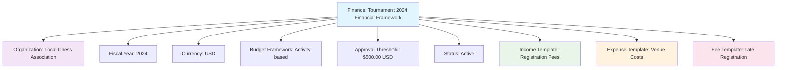

---
tags:
  - finance
  - template
  - budget
  - accounting
  - management
---

# Finance (Template Entity)

## Overview

A Finance template entity represents the financial management and accounting framework for tournaments and disciplines. It provides a comprehensive structure for handling financial information including revenue tracking, expense management, and financial reporting within the tournament system.

The Finance template enables organizations to establish standardized financial frameworks that can be applied across different tournaments, ensuring consistency in budgeting, accounting practices, and financial oversight.

## Purpose

- Enable standardized financial management across tournaments and disciplines
- Support comprehensive budget planning and expense tracking
- Facilitate financial reporting and audit trail maintenance
- Provide framework for revenue management and cost control
- Ensure compliance with financial regulations and organizational policies

## Structure

This template entity includes standard attributes from the [Base Entity](../foundation/base_entity.md).

### Domain-Specific Attributes

| Attribute | Description | Type | Required | Notes / Example |
|-----------|-------------|------|----------|-----------------|
| **Organization** | The organization this finance template belongs to | Reference | Yes | Reference to [Organization](../organization/organization.md) |
| **Fiscal Year** | The fiscal year for financial reporting | String | Optional | `"2024"`, `"FY2024"` |
| **Currency** | The primary currency for financial transactions | String | Yes | `"USD"`, `"EUR"`, `"CAD"` |
| **Budget Framework** | The budgeting approach and methodology | String | Optional | `"Zero-based"`, `"Incremental"`, `"Activity-based"` |
| **Approval Threshold** | Monetary threshold requiring additional approval | [Amount](../finance/amount.md) | Optional | Embedded amount with currency |
| **Status** | The current status of the finance template | String | Optional | `"Active"`, `"Deprecated"`, `"Draft"` |

## Example

This example shows a Finance template for the Local Chess Association's 2024 tournament framework. The template uses activity-based budgeting with USD currency and requires additional approval for expenses over $500. It includes templates for registration income, venue expenses, and late registration fees, providing a comprehensive financial management structure that can be applied to multiple tournaments throughout the fiscal year.

## See Also

- [Amount](../finance/amount.md)
- [Income](../finance/income.md)
- [Expense](../finance/expense.md)
- [Fee](../finance/fee.md)
- [Payment](../finance/payment.md)
- [Organization](../organization/organization.md)
- [Tournament](../tournament/tournament.md)
- [Base Entity](../foundation/base_entity.md)
