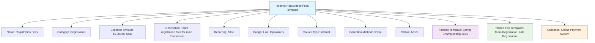

---
tags:

  - finance
  - income
  - revenue
  - tracking
  - earnings
  - budget

---

# Income (Template Entity)

## Overview

An Income template entity represents a standardized revenue source structure for tournament organizations. It provides a consistent framework for tracking, categorizing, and managing income across different tournaments and events while ensuring proper revenue oversight and financial reporting.

Income templates enable organizations to establish reusable revenue structures that facilitate budget planning, income forecasting, and comprehensive financial tracking throughout the tournament lifecycle.

## Purpose

- Enable standardized income tracking across tournaments and events
- Support comprehensive revenue planning and forecasting
- Facilitate income categorization and financial reporting
- Provide framework for revenue source management
- Ensure consistent income tracking and audit trail maintenance

## Structure

This template entity includes standard attributes from the [Base Entity](../foundation/base_entity.md).

### Domain-Specific Attributes

| Attribute | Description | Type | Required | Notes / Example |
|-----------|-------------|------|----------|-----------------|
| **Name** | The name of the income template | String | Yes | `"Registration Fees"`, `"Sponsorship Revenue"` |
| **Category** | The income category | String | Yes | `"Registration"`, `"Sponsorship"`, `"Merchandise"`, `"Concessions"` |
| **Expected Amount** | The projected income amount | [Amount](../finance/amount.md) | Yes | Embedded amount with currency |
| **Description** | Description of the income source | String | Optional | `"Team registration fees for main tournament"` |
| **Recurring** | Whether this is a recurring income | Boolean | Optional | `true`, `false` |
| **Budget Line** | Associated budget line item | String | Optional | `"Operations"`, `"Special Events"`, `"Merchandise"` |
| **Source Type** | The type of income source | String | Optional | `"Internal"`, `"External"`, `"Partner"` |
| **Collection Method** | How income is collected | String | Optional | `"Online"`, `"Cash"`, `"Check"`, `"Bank Transfer"` |
| **Status** | The status of the income template | String | Optional | `"Active"`, `"Deprecated"`, `"Draft"` |

## Example

This example shows a Registration Fees income template for spring championships. The template expects $5,000 USD from team registration fees collected online. It's linked to specific fee templates and uses an automated online collection system. This template provides consistent revenue planning and tracking across multiple tournament seasons.

## See Also

- [Amount](../finance/amount.md)
- [Fee](../finance/fee.md)
- [Expense](../finance/expense.md)
- [Finance](../finance/finance.md)
- [Payment](../finance/payment.md)
- [Base Entity](../foundation/base_entity.md)

---
