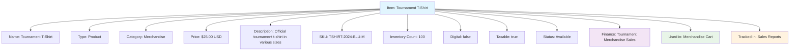

---
tags:

  - finance
  - item
  - inventory
  - line-item
  - product
  - service

---

# Item (Entity)

## Overview

An Item entity represents a product or service that can be purchased within the tournament system. It provides a consistent structure for handling item information including inventory management, pricing, and sales tracking across tournaments and related events.

Items can represent physical products (equipment, merchandise) or services (coaching, facilities) that participants, teams, or organizations can purchase as part of their tournament experience.

## Purpose

- Enable product and service management within tournament context
- Support inventory tracking and sales management
- Facilitate item pricing and purchase workflows
- Provide framework for merchandise and service sales
- Ensure consistent item information and availability tracking

## Structure

This entity includes standard attributes from the [Base Entity](../foundation/base_entity.md).

### Domain-Specific Attributes

| Attribute | Description | Type | Required | Notes / Example |
|-----------|-------------|------|----------|-----------------|
| **Name** | The name of the item | String | Yes | `"Tournament T-Shirt"`, `"Equipment Rental"` |
| **Type** | The type of item | String | Yes | `"Product"`, `"Service"`, `"Digital"` |
| **Category** | The item category | String | Optional | `"Merchandise"`, `"Equipment"`, `"Food"`, `"Service"` |
| **Price** | The item price | [Amount](../finance/amount.md) | Yes | Embedded amount with currency |
| **Description** | Description of the item | String | Optional | `"Official tournament t-shirt in various sizes"` |
| **SKU** | Stock Keeping Unit identifier | String | Optional | `"TSHIRT-2024-BLU-M"` |
| **Inventory Count** | Current inventory quantity | Integer | Optional | `50`, `100`, `0` (unlimited for services) |
| **Digital** | Whether this is a digital item | Boolean | Optional | `true`, `false` |
| **Taxable** | Whether the item is subject to tax | Boolean | Optional | `true`, `false` |
| **Status** | The status of the item | String | Optional | `"Available"`, `"Out of Stock"`, `"Discontinued"` |

## Example

This example shows a Tournament T-Shirt item available for purchase during tournaments. The shirt costs $25 USD, has 100 units in inventory, and is tracked with a specific SKU. It's a taxable physical product that can be added to merchandise carts and is tracked in sales reporting systems for comprehensive financial management.

## See Also

- [Amount](../finance/amount.md)
- [Cart](../finance/cart.md)
- [Finance](../finance/finance.md)
- [Payment](../finance/payment.md)
- [Base Entity](../foundation/base_entity.md)
