---
tags:
  - finance
  - payment
  - transaction
  - outflow
  - disbursement
---

# Payment (Entity)

## Overview

A Payment entity represents a financial outflow from the tournament organization to external parties. Payments are created when the organization disburses money to profiles (participants for refunds or prizes), vendors, or other external entities as part of tournament operations and financial management.

Payments provide complete traceability from the organization's financial records to the specific recipient and purpose, ensuring proper audit trails and financial accountability.

## Purpose

- Enable tracking of all financial outflows from the organization
- Support payment processing for refunds, prizes, and vendor payments
- Facilitate complete audit trail for financial disbursements
- Provide framework for payment method management and recording
- Ensure accountability and traceability for all outgoing payments

## Structure

This entity includes standard attributes from the [Base Entity](../foundation/base_entity.md).

### Domain-Specific Attributes

| Attribute | Description | Type | Required | Notes / Example |
|-----------|-------------|------|----------|-----------------|
| **Payee** | The recipient of the payment | Reference | Yes | Reference to [Account](../identity/account/account.md), vendor, or organization |
| **Related Item** | Reference to the source or reason for payment | Reference | Yes | Reference to expense, registration, invoice, or prize |
| **Amount** | The payment amount | [Amount](../finance/amount.md) | Yes | Embedded amount with currency |
| **Method** | The payment method used | String | Yes | `"Bank Transfer"`, `"Check"`, `"Cash"`, `"Digital Wallet"` |
| **Date** | The date the payment was made | Date | Yes | `"2024-06-05"` |
| **Reference Number** | External payment reference | String | Optional | Bank transaction ID or check number |
| **Notes** | Additional payment information | String | Optional | `"Prize for tournament winner"`, `"Venue deposit refund"` |
| **Approval** | Payment approval information | Reference | Optional | Reference to approving authority |
| **Status** | The payment status | String | Yes | `"Pending"`, `"Completed"`, `"Failed"`, `"Cancelled"` |

## Example

```mermaid
graph TD
    P[Payment: Tournament Winner Prize] --> PAY[Payee: Team Alpha Captain]
    P --> RI[Related Item: Prize Expense Record]
    P --> A[Amount: $500.00 USD]
    P --> M[Method: Bank Transfer]
    P --> D[Date: 2024-06-05]
    P --> RN[Reference Number: TXN-2024-001234]
    P --> N[Notes: First place prize payment]
    P --> APP[Approval: Tournament Director]
    P --> S[Status: Completed]

    P --> PROF[Account: John Smith - Team Alpha]
    P --> EXP[Expense: Tournament Prizes]
    P --> FIN[Finance: Championship 2024]

    style P fill:#e1f5fe
    style PROF fill:#f3e5f5
    style EXP fill:#e8f5e8
    style FIN fill:#fff3e0
```

This example shows a payment to the Team Alpha captain for the tournament winner's prize. The $500 USD payment was made via bank transfer, has been completed with a reference number, and is linked to both the recipient's profile and the underlying prize expense record. This ensures complete traceability from the financial budget through to the actual disbursement.

## See Also

- [Amount](../finance/amount.md)
- [Expense](../finance/expense.md)
- [Receipt](../finance/receipt.md)
- [Finance](../finance/finance.md)
- [Account](../identity/account/account.md)
- [Base Entity](../foundation/base_entity.md)
