---
tags:
- finance
- receipt
- transaction
- inflow
- income
---

# Receipt (Entity)

## Overview

A Receipt entity represents a financial inflow to the tournament organization from external parties
.
Receipts are created when the organization receives money from profiles (participants), sponsors, vendors, or other sources as part of tournament operations and revenue collection.

Receipts provide complete traceability from the payment source to the organization's financial records, ensuring proper audit trails and revenue accountability for all incoming payments.

## Purpose

- Enable tracking of all financial inflows to the organization
- Support revenue collection for fees, sponsorships, and sales
- Facilitate complete audit trail for financial receipts
- Provide framework for payment method tracking and reconciliation
- Ensure accountability and traceability for all incoming payments

## Structure

This entity includes standard attributes from the [Base Entity](../foundation/base_entity.md).

### Domain-Specific Attributes

| Attribute | Description | Type | Required | Notes / Example |
|-----------|-------------|------|----------|-----------------|
| **Payer** | The party making the payment | Reference | Yes | Reference to [Account](../identity/account/account.md), sponsor, or organization |
| **Related Item** | Reference to the source or reason for payment | Reference | Yes | Reference to fee, registration, ticket, or sponsorship |
| **Amount** | The receipt amount | [Amount](../finance/amount.md) | Yes | Embedded amount with currency |
| **Method** | The payment method used | String | Yes | `"Online"`, `"Credit Card"`, `"Cash"`, `"Bank Transfer"` |
| **Date** | The date the payment was received | Date | Yes | `"2024-03-15"` |
| **Transaction ID** | External transaction identifier | String | Optional | Payment processor transaction ID |
| **Notes** | Additional receipt information | String | Optional | `"Team registration payment"`, `"Merchandise purchase"` |
| **Processor** | Payment processor used | String | Optional | `"PayPal"`, `"Stripe"`, `"Bank"`, `"Cash"` |
| **Status** | The receipt status | String | Yes | `"Pending"`, `"Completed"`, `"Failed"`, `"Refunded"` |

## Example

```mermaid
graph TD
    R[Receipt: Team Registration Payment] --> PAY[Payer: Team Beta Captain]
    R --> RI[Related Item: Team Registration Fee]
    R --> A[Amount: $75.00 USD]
    R --> M[Method: Credit Card]
    R --> D[Date: 2024-03-15]
    R --> TID[Transaction ID: ch_3NgIg2LkdIwHu7iX1]
    R --> N[Notes: Team registration payment]
    R --> P[Processor: Stripe]
    R --> S[Status: Completed]

    R --> PROF[Account: Sarah Johnson - Team Beta]
    R --> FEE[Fee: Team Registration Fee Template]
    R --> FIN[Finance: Spring Tournament 2024]

    style R fill:#e1f5fe
    style PROF fill:#f3e5f5
    style FEE fill:#e8f5e8
    style FIN fill:#fff3e0
```

This example shows a receipt for Team Beta's registration payment.
The $75 USD payment was received via credit card through Stripe, has been completed with a transaction ID, and is linked to both the payer's profile and the underlying registration fee
.
This ensures complete traceability from the revenue source through to the organization's financial records.

## See Also

- [Amount](../finance/amount.md)
- [Fee](../finance/fee.md)
- [Payment](../finance/payment.md)
- [Income](../finance/income.md)
- [Finance](../finance/finance.md)
- [Account](../identity/account/account.md)
- [Base Entity](../foundation/base_entity.md)
