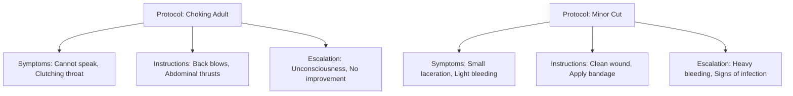

---
tags:

  - first-aid
  - medical
  - emergency
  - protocol
  - safety

---

# First Aid Domain

## Overview

The First Aid domain provides a structured way to define, manage, and implement standardized first aid protocols across tournaments. This includes medical emergency procedures, injury response protocols, and safety guidelines that can be consistently applied while allowing for tournament-specific customization.

## Purpose

This domain ensures tournament organizers have access to comprehensive, standardized first aid procedures that can be quickly referenced during medical emergencies. It supports consistent emergency response across different venues and tournament types while maintaining flexibility for specific medical situations and local requirements.

## Structure

The First Aid domain consists of interconnected entities that work together to provide comprehensive emergency medical response:

- **[Protocol](protocol.md)** - Complete standardized procedures for specific medical situations
- **[Symptom](symptom.md)** - Observable indicators that help identify medical conditions
- **[Instruction](instruction.md)** - Actionable steps within first aid procedures
- **[Escalation](escalation.md)** - Conditions requiring professional medical intervention

## Example

This example demonstrates how first aid protocols organize medical response procedures. The "Choking Adult" protocol contains specific symptoms to identify the emergency, step-by-step instructions for treatment, and clear escalation criteria for when professional help is needed. This structure ensures tournament staff can quickly identify situations, follow proven procedures, and know when to seek advanced medical assistance, ultimately improving emergency response effectiveness and participant safety.

## See Also

- [Protocol](protocol.md) - Detailed first aid procedure templates
- [Instruction](instruction.md) - Individual actionable steps
- [Escalation](escalation.md) - Professional intervention criteria
- [Venue](../venue/README.md) - Location-specific safety requirements
- [Safety](../safety/README.md) - Overall tournament safety framework
