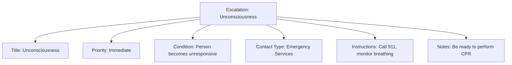

---
tags:
  - first-aid
  - escalation
  - emergency
  - medical
  - template
---

# Escalation (Template Entity)

## Overview

An Escalation entity template defines conditions or situations that require professional medical intervention beyond basic first aid. These criteria help first aid providers determine when to seek additional medical assistance and what type of help is needed.

## Purpose

Escalation criteria ensure tournament staff recognize when medical situations exceed basic first aid capabilities and require professional intervention. They provide clear guidelines for when and how to contact emergency services, preventing delays in critical care and ensuring appropriate response levels for different medical emergencies.

## Structure

This template entity includes standard attributes from the [Base Entity](../foundation/base_entity.md).

| Attribute        | Description                                             | Type   | Required | Notes / Example                                                      |
| ---------------- | ------------------------------------------------------- | ------ | -------- | -------------------------------------------------------------------- |
| **Title**        | Clear, concise description of the escalation condition. | String | Yes      | `"Unconsciousness"`, `"Severe Bleeding"`, `"Difficulty Breathing"`   |
| **Priority**     | Level of urgency for medical response.                  | String | Yes      | `"Immediate"`, `"Urgent"`, `"Non-urgent"`                            |
| **Condition**    | Detailed description of when this escalation applies.   | Text   | Yes      | `"Person becomes unresponsive or shows signs of severe head injury"` |
| **Contact Type** | Type of medical assistance required.                    | String | Yes      | `"Emergency Services"`, `"Medical Staff"`, `"Hospital"`              |
| **Instructions** | Specific actions to take when escalating.               | Text   | Yes      | `"Call 911, stay with the person, prepare to provide CPR if needed"` |
| **Notes**        | Additional context or important considerations.         | Text   | No       | `"Have emergency contact information readily available"`             |

## Example

This escalation example demonstrates critical decision-making structure for medical emergencies. The "Unconsciousness" escalation includes all essential attributes: a clear title for rapid identification, immediate priority level indicating urgency, specific condition description for accurate assessment, emergency services contact type for appropriate response, detailed instructions for proper escalation actions, and safety notes for ongoing care. This structure ensures tournament staff can quickly recognize when situations exceed basic first aid capabilities and take appropriate action to secure professional medical intervention, ultimately reducing response times and improving outcomes during serious medical emergencies.

## See Also

- [Protocol](protocol.md) - Complete procedures that reference escalation criteria
- [Instruction](instruction.md) - Sequential steps that may trigger escalation
- [Symptom](symptom.md) - Observable indicators that may require escalation
- [Base Entity](../foundation/base_entity.md) - Standard entity attributes
