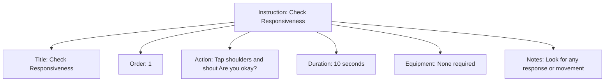

---
tags:
  - first-aid
  - instruction
  - procedure
  - medical
  - template
---

# Instruction (Template Entity)

## Overview

An Instruction entity template defines a standardized, actionable step that forms part of a first aid procedure. Each instruction represents a specific action to be taken in sequence to address a medical situation or injury.

## Purpose

Instructions break down complex first aid procedures into clear, manageable steps that can be followed under pressure. They ensure consistent treatment approaches and help tournament staff perform medical procedures correctly and safely during emergencies.

## Structure

This template entity includes standard attributes from the [Base Entity](../foundation/base_entity.md).

| Attribute     | Description                                                 | Type    | Required | Notes / Example                                                                  |
| ------------- | ----------------------------------------------------------- | ------- | -------- | -------------------------------------------------------------------------------- |
| **Title**     | Clear, concise description of the action to take.           | String  | Yes      | `"Check Responsiveness"`, `"Apply Direct Pressure"`, `"Call Emergency Services"` |
| **Order**     | Sequence number in the procedure.                           | Integer | Yes      | `1`, `2`, `3`                                                                    |
| **Action**    | Detailed description of how to perform this instruction.    | Text    | Yes      | `"Place two fingers on the person's wrist to check for pulse"`                   |
| **Duration**  | Expected time to complete this instruction (if applicable). | String  | No       | `"30 seconds"`, `"Until bleeding stops"`, `"Until help arrives"`                 |
| **Equipment** | Required items to perform this instruction (if any).        | List    | No       | `["Gloves", "Bandage", "First Aid Kit"]`                                         |
| **Notes**     | Additional context, warnings, or important considerations.  | Text    | No       | `"Do not move the person if spinal injury is suspected"`                         |

## Example

This instruction example demonstrates structured emergency response steps. The "Check Responsiveness" instruction includes all essential attributes: a clear title for quick reference, order number for proper sequencing, detailed action description for correct execution, time duration for pacing, equipment requirements (none in this case), and safety notes for proper implementation. This structure ensures tournament staff can follow precise, time-appropriate steps during medical emergencies, reducing confusion and improving treatment consistency across different situations and responders.

## See Also

- [Protocol](protocol.md) - Complete procedures containing multiple instructions
- [Escalation](escalation.md) - Criteria for advancing to professional care
- [Symptom](symptom.md) - Observable indicators that trigger instruction sequences
- [Base Entity](../foundation/base_entity.md) - Standard entity attributes
