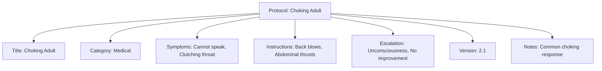

---
tags:
  - first-aid
  - protocol
  - medical
  - emergency
  - template
---

# Protocol (Template Entity)

## Overview

A Protocol entity template defines a complete set of standardized procedures for responding to specific medical situations or injuries that may occur during tournaments. It serves as a reusable blueprint for creating consistent first aid protocols, combining symptoms, instructions, and escalation criteria into a comprehensive response plan.

## Purpose

Protocols ensure tournament staff have immediate access to proven medical response procedures during emergencies. They standardize treatment approaches across different venues and events while providing clear guidance for when professional medical intervention is required.

## Structure

This template entity includes standard attributes from the [Base Entity](../foundation/base_entity.md).

| Attribute        | Description                                             | Type              | Required | Notes / Example                                                              |
| ---------------- | ------------------------------------------------------- | ----------------- | -------- | ---------------------------------------------------------------------------- |
| **Title**        | Clear, concise title identifying the medical situation. | String            | Yes      | `"Choking (Adult)"`, `"Minor Cut"`, `"Heat Exhaustion"`                      |
| **Category**     | Classification of the medical situation.                | String            | Yes      | `"Trauma"`, `"Medical"`, `"Environmental"`                                   |
| **Symptoms**     | List of observable indicators for this situation.       | List[Symptom]     | Yes      | References [Symptom](symptom.md) entities                                   |
| **Instructions** | Ordered sequence of actions to take.                    | List[Instruction] | Yes      | References [Instruction](instruction.md) entities                           |
| **Escalation**   | Conditions requiring professional medical help.         | List[Escalation]  | Yes      | References [Escalation](escalation.md) entities                             |
| **Media**        | References to relevant instructional media.             | List[Media]       | No       | References [Media](../media/media_asset.md) entities                        |
| **Version**      | Version identifier for tracking updates.                | String            | Yes      | `"1.2"`                                                                      |
| **Notes**        | Additional context or important considerations.         | Text              | No       | `"Common in contact sports"`, `"Requires specific training"`                 |

## Example

This protocol example demonstrates comprehensive emergency response documentation. The "Choking Adult" protocol includes all required attributes: a clear title for quick identification, medical category classification, observable symptoms for situation assessment, step-by-step instructions for treatment, escalation criteria for professional intervention, and version tracking for updates. This structure enables tournament staff to rapidly identify choking emergencies and follow proven treatment procedures while knowing exactly when to call emergency services, ultimately improving response times and treatment outcomes during critical medical situations.

## See Also

- [Instruction](instruction.md) - Individual actionable steps within protocols
- [Escalation](escalation.md) - Criteria for professional medical intervention
- [Symptom](symptom.md) - Observable indicators for situation identification
- [Base Entity](../foundation/base_entity.md) - Standard entity attributes
