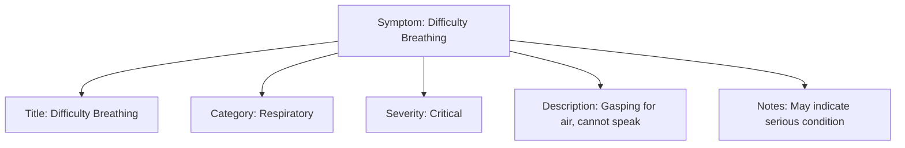

---
tags:

  - first-aid
  - symptom
  - medical
  - diagnosis
  - template

---

# Symptom (Template Entity)

## Overview

A Symptom entity template defines a standardized way to describe observable indicators that help identify specific medical situations or injuries. These symptoms serve as key recognition points for first aid providers and help in determining the appropriate response protocol.

## Purpose

Symptoms provide tournament staff with clear, observable criteria for identifying medical emergencies and selecting appropriate first aid protocols. They enable rapid situation assessment and ensure consistent recognition of medical conditions across different responders and venues.

## Structure

This template entity includes standard attributes from the [Base Entity](../foundation/base_entity.md).

| Attribute       | Description                                            | Type   | Required | Notes / Example                                                           |
| --------------- | ------------------------------------------------------ | ------ | -------- | ------------------------------------------------------------------------- |
| **Title**       | Clear, concise description of the symptom.             | String | Yes      | `"Difficulty Breathing"`, `"Severe Bleeding"`, `"Loss of Consciousness"`  |
| **Category**    | Classification of the symptom type.                    | String | Yes      | `"Respiratory"`, `"Circulatory"`, `"Neurological"`, `"Trauma"`            |
| **Severity**    | Level of urgency associated with this symptom.         | String | Yes      | `"Critical"`, `"Serious"`, `"Moderate"`, `"Minor"`                        |
| **Description** | Detailed explanation of how to recognize this symptom. | Text   | Yes      | `"Person is gasping for air, unable to speak in complete sentences"`      |
| **Notes**       | Additional context or important considerations.        | Text   | No       | `"May be accompanied by chest pain"`, `"Common in high-intensity sports"` |

## Example

This symptom example demonstrates structured medical assessment criteria. The "Difficulty Breathing" symptom includes all essential attributes: a clear title for quick identification, respiratory category for systematic classification, critical severity level indicating urgency, detailed description for accurate recognition, and contextual notes for additional considerations. This structure enables tournament staff to rapidly identify respiratory emergencies using observable indicators, ensuring consistent assessment across different responders and facilitating appropriate protocol selection for immediate and effective medical response during critical situations.

## See Also

- [Protocol](protocol.md) - Complete procedures that use symptoms for identification
- [Instruction](instruction.md) - Treatment steps triggered by specific symptoms  
- [Escalation](escalation.md) - Conditions that may result from severe symptoms
- [Base Entity](../foundation/base_entity.md) - Standard entity attributes
