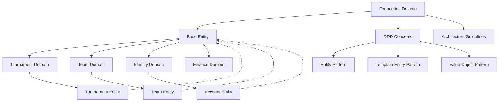

---
tags:

  - foundation
  - ddd
  - architecture
  - base-entity
  - template
  - domain-modeling

---

# Foundation Domain

The Foundation domain provides the fundamental architectural patterns and core models that form the foundation of the Tournament Organizer system. This domain defines essential patterns, structures, and Domain-Driven Design concepts that all other domains build upon to ensure consistency, reliability, and maintainability across the entire system.

## Purpose

The Foundation domain serves as the architectural cornerstone by establishing:

- **Base Entity patterns** that ensure consistent data modeling across all domains
- **Domain-Driven Design concepts** that guide proper domain modeling practices
- **Template-Instance relationships** that enable reusable, configurable entity patterns
- **Standard attributes and behaviors** that every entity in the system must implement
- **Version control and lifecycle management** patterns for robust entity evolution

## Structure

This domain contains three core architectural components:

| Component | Type | Purpose |
|-----------|------|---------|
| **Base Entity** | Technical Foundation | Defines standard attributes (ID, version, status, timestamps) and behaviors that every entity must implement |
| **DDD Concepts** | Architectural Guide | Comprehensive documentation of Domain-Driven Design patterns: Entity, Template Entity, and Value Object |
| **Domain Overview** | Reference Documentation | Usage guidelines and architectural importance for developers implementing other domains |

### Base Entity Foundation

All entities throughout the Tournament Organizer system inherit standard attributes from the Base Entity, including:

- **Unique ID** and **Template ID** management for identity and template relationships
- **Version control** with semantic versioning for entity evolution
- **Status management** with multiple status types for lifecycle tracking
- **Timestamp tracking** for audit trails and change management
- **Template-Instance relationships** for reusable pattern implementation

## Example

This diagram illustrates how the Foundation domain enables consistent architecture across all system domains:

The Foundation domain establishes the architectural foundation that enables all other domains to implement consistent, reliable, and maintainable business logic. By providing standardized base patterns, DDD guidance, and template-instance relationships, it ensures that every domain can focus on business-specific logic while maintaining system-wide consistency for identity management, versioning, status tracking, and entity lifecycle management.

## See Also

- [Base Entity Technical Foundation](base_entity.md)
- [Domain-Driven Design Concepts](ddd_concepts.md)
- [Tournament Domain](../tournament/README.md)
- [Team Domain](../team/README.md)
- [Identity Domain](../identity/README.md)
- [Business Domains Overview](../README.md)
