---
tags:
  - foundation
  - base-entity
  - architecture
  - template
  - entity
  - technical-foundation
---

# Base Entity (Technical Foundation)

The Base Entity serves as the technical foundation shared by all entities and template entities within the Tournament Organizer system. It defines the standard attributes and behaviors that every entity must implement, regardless of its domain context or whether it's a template or instance. This ensures consistency, auditability, and proper lifecycle management across all business domains.

## Purpose

The Base Entity provides:

- **Consistent Identity Management** through standardized unique identifiers and template relationships
- **Version Control** with semantic versioning for entity evolution and template management
- **Status Tracking** with multiple status types for comprehensive lifecycle management
- **Audit Trail Foundation** through automatic timestamp tracking and change management
- **Template-Instance Patterns** enabling reusable, configurable entity structures across domains

## Structure

All entities in the Tournament Organizer system include these standard attributes from the Base Entity:

| Attribute | Description | Type | Required | Notes / Example |
|-----------|-------------|------|----------|-----------------|
| **Unique ID** | The unique, immutable identifier for this specific entity instance or template | UUID | Yes | Primary Key. Standardized as UUID version 4. Example: `acc-a1b2c3d4-e5f6-7890-1234-567890abcdef` |
| **Template ID** | Reference to the template this entity is based on. For templates: equals Unique ID. For instances: references parent template | UUID | Yes | Example: `tmpl-a1b2c3d4-e5f6-7890-1234-567890abcdef` |
| **Version** | Version number following semantic versioning (MAJOR.MINOR.PATCH) for tracking entity and template evolution | String | Yes | Example: `1.0.0` for initial, `1.1.0` for minor updates, `2.0.0` for major changes |
| **Statuses** | List of current statuses for comprehensive lifecycle and state management | List[Status] | Yes | Example: `[{"Type": "System", "Value": "Active"}, {"Type": "Entity", "Value": "Draft"}]` |
| **Created At** | Timestamp when entity was first persisted in the system | DateTime | Yes | System-managed. ISO 8601 format (UTC). Example: `2024-03-10T15:00:00Z` |
| **Last Updated** | Timestamp when entity was last modified | DateTime | Yes | System-managed. ISO 8601 format (UTC). Example: `2024-07-15T11:30:00Z` |

## Example

This diagram illustrates how Base Entity attributes enable consistent entity management across different domains:

```mermaid
graph TD
    BaseEntity[Base Entity Foundation] --> Identity[Identity Management]
    BaseEntity --> Versioning[Version Control]
    BaseEntity --> Status[Status Management]
    BaseEntity --> Audit[Audit Trail]

    Identity --> UniqueID[Unique ID: UUID]
    Identity --> TemplateID[Template ID: UUID]

    Versioning --> SemVer[Semantic Versioning]
    Versioning --> TemplateVersion[Template Evolution]

    Status --> SystemStatus[System Status: Active/Inactive]
    Status --> EntityStatus[Entity Status: Draft/Published]
    Status --> CustomStatus[Custom Domain Status]

    Audit --> CreatedAt[Created At: ISO 8601]
    Audit --> LastUpdated[Last Updated: ISO 8601]

    BaseEntity --> TournamentExample[Tournament Entity Example]
    TournamentExample --> TournamentID[ID: tour-12345...]
    TournamentExample --> TournamentTemplate[Template ID: tmpl-67890...]
    TournamentExample --> TournamentVersion[Version: 2.1.0]
    TournamentExample --> TournamentStatus[Status: System:Active, Entity:Published]
```

The Base Entity foundation ensures that every entity in the system - whether a Tournament, Team, Account, or any other domain entity - maintains consistent identity management, version tracking, status management, and audit capabilities. This enables reliable cross-domain references, template-based entity creation, comprehensive lifecycle management, and system-wide auditability for compliance and troubleshooting purposes.

## Technical Considerations

### ID and Template Management

- **Unique ID**: Must be unique across all entities and templates, immutable once assigned, used for direct entity references
- **Template ID**: For templates matches Unique ID, for instances references parent template, enables template lineage tracking
- **Version Management**: Follows semantic versioning with MAJOR for breaking changes, MINOR for backward-compatible features, PATCH for fixes

### Template-Instance Relationship

- **Template Creation**: Unique ID and Template ID are identical, initial version is 1.0.0
- **Instance Creation**: Gets new Unique ID, Template ID references parent template, version matches template at creation
- **Template Updates**: Create new version, existing instances remain at creation version, new instances use latest version

### System Management

- **Timestamps**: CreatedAt and LastUpdatedAt are managed by data persistence layer
- **Status Management**: Entities must have at least one status, multiple status types can be active simultaneously
- **Validation Rules**: All IDs must be valid UUID v4, version must follow semantic versioning format

## See Also

- [Domain-Driven Design Concepts](ddd_concepts.md)
- [Foundation Domain Overview](README.md)
- [Tournament Entity Implementation](../tournament/tournament.md)
- [Team Entity Implementation](../team/team.md)
- [Account Entity Implementation](../identity/account/account.md)
