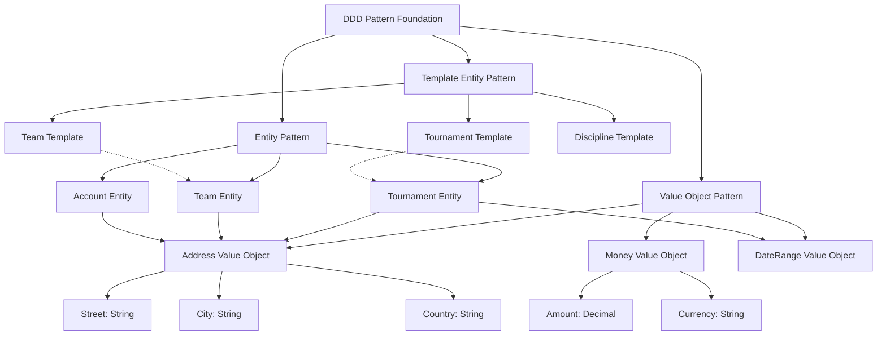

---
tags:

  - foundation
  - ddd
  - domain-driven-design
  - entity
  - template-entity
  - value-object
  - architecture

---

# Domain-Driven Design Concepts

This document defines the core Domain-Driven Design (DDD) concepts used throughout the Tournament Organizer system. These patterns provide the foundation for modeling complex business domains and ensuring consistency across all business models. Understanding these concepts is essential for developers implementing any domain within the system.

## Purpose

The DDD concepts establish:

- **Consistent Modeling Patterns** for all business entities across domains
- **Clear Entity Distinctions** between entities, template entities, and value objects
- **Architectural Guidelines** for proper domain model implementation
- **Design Principles** that ensure maintainable and scalable domain models
- **Pattern Relationships** that clarify when and how to use each pattern type

## Structure

The foundation defines three core DDD patterns used throughout the Tournament Organizer system:

| Pattern | Type | Purpose |
|---------|------|---------|
| **Entity** | Identity-Based Domain Object | Objects with unique identity that can change over time while maintaining identity |
| **Template Entity** | Blueprint Pattern | Reusable templates that define structure and defaults for creating entity instances |
| **Value Object** | Value-Based Domain Object | Immutable objects defined by their values rather than identity |

### Core Pattern Definitions

#### Entity

An entity is a domain object with unique identity and mutable state, encapsulating business logic and lifecycle management.

**Characteristics**: Unique identity, mutable state, business logic, persistence, lifecycle management

**Examples**: Tournament, Team, Participant, Venue, Account

#### Template Entity

A template entity serves as a blueprint for creating other entities, defining structure, defaults, and constraints.

**Characteristics**: Blueprint pattern, versioned, reusable, configurable, validation rules

**Examples**: Tournament Template, Team Template, Venue Template, Discipline Template

#### Value Object

A value object represents domain concepts through their attributes rather than identity, providing immutable value-based semantics.

**Characteristics**: Immutable, value-based equality, no identity, self-validating, composable

**Examples**: Address, Money, DateRange, Score, Contact Information

## Example

This diagram illustrates how DDD patterns work together in the Tournament Organizer system:

The DDD patterns enable clear separation of concerns where entities handle identity and business logic, template entities provide reusable blueprints for common structures, and value objects encapsulate domain concepts without identity. This creates a robust, maintainable architecture where tournaments can be created from templates, teams can be managed as independent entities, and complex concepts like addresses and monetary amounts are consistently modeled across all domains.

### Entity vs Template Entity vs Value Object

| Aspect | Entity | Template Entity | Value Object |
|--------|--------|-----------------|--------------|
| **Identity** | Has unique identity | Has unique identity (blueprint) | No identity, value-based |
| **Mutability** | Can change state | Can evolve (versioned) | Immutable |
| **Purpose** | Business logic execution | Blueprint for instances | Value representation |
| **Equality** | Identity-based | Identity-based | Value-based |
| **Lifecycle** | Has complete lifecycle | Template evolution | No lifecycle |
| **Persistence** | Persisted with identity | Persisted as blueprint | Embedded in entities |
| **References** | Referenced by ID | Referenced by template ID | Embedded directly |
| **Reusability** | Specific instance | Reusable across instances | Reusable in any entity |

### Implementation Guidelines

#### Entity Design

- Ensure unique, immutable identities using [Base Entity](base_entity.md) foundation
- Handle entity state changes with proper validation and business rules
- Encapsulate domain logic within entities for consistency
- Implement proper lifecycle management for creation, modification, and deletion

#### Template Entity Design

- Design templates for flexibility, reuse, and customization across use cases
- Implement comprehensive version management for template evolution
- Define clear validation rules and constraints for instances
- Document template purpose, usage patterns, and customization options

#### Value Object Design

- Ensure complete immutability after creation
- Implement value-based equality for proper comparison
- Validate value object state comprehensively on creation
- Use composition to build complex domain concepts from simpler value objects

## See Also

- [Base Entity Technical Foundation](base_entity.md)
- [Foundation Domain Overview](README.md)
- [Tournament Domain Implementation](../tournament/README.md)
- [Team Domain Implementation](../team/README.md)
- [Identity Domain Implementation](../identity/README.md)
- [Business Domains Overview](../README.md)
